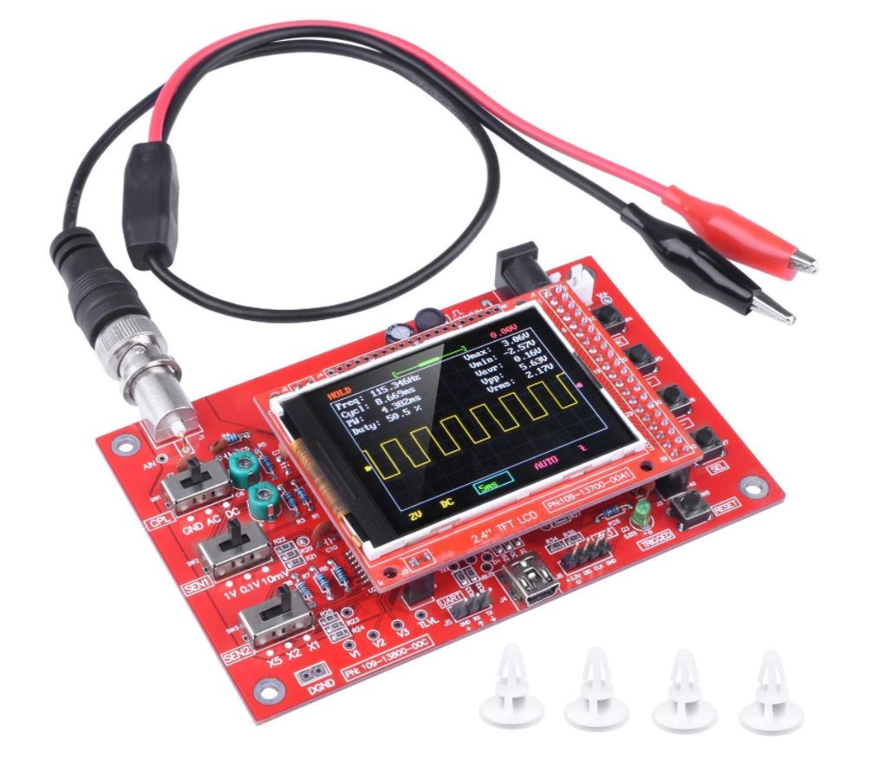
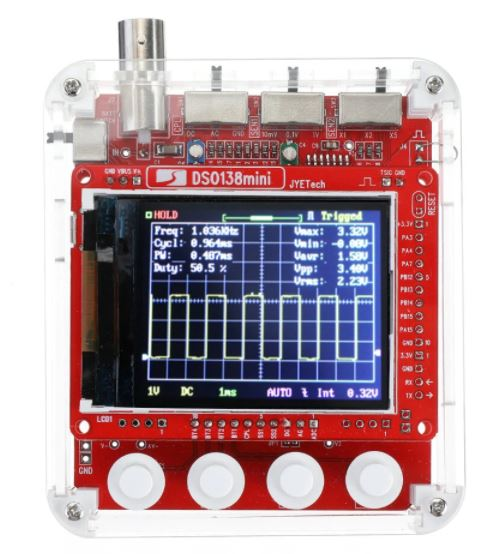

++++++++++++++++++++++++++++++++++++++++++++++++++++++++++++++++++++++++++++++++++++++++++++++++++++
Mes réalisations
++++++++++++++++++++++++++++++++++++++++++++++++++++++++++++++++++++++++++++++++++++++++++++++++++++

:Auteur: J.Soranzo
:Date de création: 02/2022
:Date dernière maj: 13/03/2022
:Societe: VoRoBoTics
:Entity: VoLAB

.. |clearer|  raw:: html

   

.. contents::
    :backlinks: top

====================================================================================================
Règles de nommage
====================================================================================================
- nom du fichier = nom de l'objet (de préférence sa vrai référence)
- chaque objet à un part
- chaque part à **SA** spreadsheet cela permet d'avoir plusieurs fois le même terme (ex: long, larg)
- spreadsheet = nomDeLObjetSp (permet d'identifier les spreadsheet parmi d'autres noms)
- un diamètre = diam
- une longueur = long
- une largeur = larg
- une hauteur = haut
- une épaisseur = ep
- un entraxe ou une distance entre 2 points = dist
- on ne répète pas le nom de l'objet dans les éléments de la spreadsheet
- On suffixe en commençant par le plus générique

exemples:

- bonSp.bornierVisTrouDiam est incorrecte : bornierSp.VisTrouDiam serais correcte
- suffixe : VisTrouDiam, VisTrouPosX....

====================================================================================================
Versionning
====================================================================================================
Pas de git pour ce projet !
les versions soit 3 digits soit 3 digits. 1 sous version. Je suis indécis. J'aurais tendance à tendre
vers 3 digits seuls (ça fait moins de caractères à taper)

====================================================================================================
Le model de base 35mm large
====================================================================================================
J'ai entièrement repris le modèle de base sous Freecad avec spreadsheet paramétrable.

Face avant détachable.

Insert filetés 

`Sur AMAZON ruthex Boîte M2 + M3 + M4 + M5 insert fileté`_

.. _`Sur AMAZON ruthex Boîte M2 + M3 + M4 + M5 insert fileté` : https://www.amazon.fr/gp/product/B08K1BVGN9/ref=ppx_yo_dt_b_asin_title_o06_s00?ie=UTF8&psc=1

.. image:: images/ruthexBox.JPG 
   :width: 300 px

Dimensions:

.. image:: images/ruthexBoxDimension.JPG 
   :width: 300 px

& ventilation.

Fortement inspiré du model de Cordless

ajout également d'une vis pointeau sous les XT60

Calculs relatifs à la ventilation
----------------------------------------------------------------------------------------------------
Calculer le nombre de fentes.

On connaît:

- la largeur du modules
- l'épaisseur de la parois
- la largeur des fentes
- l'écart entre les fentes

On veut le nombre de fentes et la longeur de la répétission

En effet dans Freecad, il faut ces 2 paramètres::

   grandA =(largeurModuleBase - 2 * epaisseurParois) / 2
   ventilLargeurRepet =grandA - ventilEcartfente / 2 - (ventilLargeurFentes + ventilEcartfente)
   ventilNbrFents =ceil(ventilLargeurRepet / (ventilLargeurFentes + ventilEcartfente)) + 1

Profile
----------------------------------------------------------------------------------------------------

.. image:: images/profileOriginalXT60.JPG  
   :width: 300 px

Côtes XT60 mauvaise :

- largeur = 8
- largeur du sommet = 3

Juste :

- hauteur = 15.75 mais  affaissement des couche d'impression à compenser
- le 13.25

.. image:: images/profilesFav.svg 
   :width: 600 px

|clearer|

.. image:: images/moduleDeBaseSousFreecad.jpg 
   :width: 600 px

|clearer|

.. image:: images/moduleBaseVisPointeauDetail.jpg 
   :width: 300 px

.. index::
    single: Switch

Switch ON/OFF
----------------------------------------------------------------------------------------------------
J'ai eu la chance de récupérer un carton entier de ces switch donc, je les utilise. Libre à vous de 
changer.

Toujours est-il que voici la référence pour les flemmards : chez `Farnell C1500ATAAA`_

.. _`Farnell C1500ATAAA` : https://fr.farnell.com/arcolectric/c1500ataaa/interrupteur-a-bascule-spst-noir/dp/150549?st=c1500

Fabrcant ARCOLECTRIC (BULGIN LIMITED).

:download:`datasheet C1500<fichiersJoints/C1500AT_2711451.pdf>`

.. image:: images/c150AA.jpg 

.. index::
    single: XT60

XT60
----------------------------------------------------------------------------------------------------
Sur AMAZON facile à trouver par exemple `AUTOUTLET 20 PCS 10 Paires XT60`_

.. _`AUTOUTLET 20 PCS 10 Paires XT60` : https://www.amazon.fr/gp/product/B07C3R5W31/ref=ppx_yo_dt_b_asin_title_o08_s00?ie=UTF8&th=1

.. image:: images/xt60.jpg 
   :width: 300 px

Nomenclature de base
----------------------------------------------------------------------------------------------------
.. csv-table:: Nomenclature Module de base hors pièces imprimées
   :file: ../../_02-realisation/_03-cao_3D/mesCreations/base35mmParam/nomBASE.csv
   :delim: ,
   :encoding: UTF-8
   :align: left
   :header-rows: 1

====================================================================================================
Alimentation des modules en plus base tension
====================================================================================================
Module convertisseur réglable 2A
----------------------------------------------------------------------------------------------------
Ce convertisseur est nécessaire quand les éléments du module ne supportent pas des tension d'entrées
comprise entre 15 et 24V.

Il convient alors de régler la tension de sortie du convertisseur à la bonne valeur

Convertisseur DC/DC 1A réglable

Alimentation du rail : 19 à 25V environ

Courant de sortie nominal annoncé : 2A

Ce style de DCDC: 

13.57€ par 10pcs chez `Banggood lm2596 DC-DC`_

.. WARNING:: Pb avec le model 3D récup sur GARCAD
   :class: without-title

   Écart entre trou mesuré : 31mm versus 30.26 sur le step

.. image:: images/DCDC2596ModelPb.JPG 
   :width: 600 px

.. _`Banggood lm2596 DC-DC` : https://www.banggood.com/fr/10Pcs-LM2596-DC-DC-Adjustable-Step-Down-Power-Supply-Module-p-963307.html?rmmds=detail-left-hotproducts__7&cur_warehouse=CN

Uin : 35V max

Uout : de 1.35V à 35V mouais !

pb la fixation: 2 trous M3 mais:

.. WARNING:: ATTENTION Mettre des vis nylon : risque de contact avec un broche de capa 

`VIS M3x6 NYLON AMAZON`_

.. _`VIS M3x6 NYLON AMAZON` : https://www.amazon.fr/Maintient-Casquette-Convient-nombreux-endroits/dp/B097P43SJC/ref=sr_1_19?keywords=vis+nylon&qid=1649422582&sr=8-19

.. image:: images/positionnementDCDC.jpg 
   :width: 300 px

Tige laiton (connexion des XT60)
----------------------------------------------------------------------------------------------------

Tige en laiton diam 2 pour les rails chez Leroymerlin diam 3 (le mieux serait du 2)

ou manomano tous les diamètre ou chez `AMAZON 20 Pièces T2 Baguettes de Soudage en laiton de 2mm x 250mm`_

.. _`AMAZON 20 Pièces T2 Baguettes de Soudage en laiton de 2mm x 250mm` : https://www.amazon.fr/gp/product/B08S728MMZ/ref=ppx_yo_dt_b_asin_title_o01_s01?ie=UTF8&psc=1

.. figure:: images/tigeLaitons.jpg
    :width: 300 px
    :align: left

    Position des tiges en laiton

20 tiges de 250mm 14€ soit 0.7€ les 250mm

====================================================================================================
Module primaire
====================================================================================================
AC/DC adaptateur :

- prise pc DELL voir 124-8898 chez RS

- prise MSI ?

.. index::
    pair: Modules; U/I en ligne

====================================================================================================
Module mesure Tension/courant de la ligne
====================================================================================================

.. image:: images/uimodule.JPG 
   :width: 600 px

Le but de ce module est d'indiquer la tension et le courant consommé par les modules qui se trouvent
après lui dans la chaîne. C'est le seul module qui n'est pas en parallèle.

====================================================================================================
Outillage pour souder les XT60
====================================================================================================
Voici un outillage permettant de souder les tiges laiton aux XT60 au bonnes dimensions.

.. image:: images/outillageXT.jpg 
   :width: 600 px

Il suffit de régler la partie de droite à la largeur du module considéré.

Il y est équipé d'un réglet disponible chez Castorama

Largeur : 24mm +/-1 et moins de 1mm d'épaisseur

toto

.. index::
    pair: Modules; USB 3A

====================================================================================================
USB 5V 3A
====================================================================================================
Convertisseurs: `ANGEEK Lot de 5 modules d'alimentation USB DC 6-24 V à 5 V 3 A`_ chez AMAZON 10€/5

.. _`ANGEEK Lot de 5 modules d'alimentation USB DC 6-24 V à 5 V 3 A` : https://www.amazon.fr/gp/product/B07Q7TTD6C/ref=ppx_yo_dt_b_asin_title_o00_s01?ie=UTF8&psc=1

.. image:: images/module5V3ASurAMAZON.jpg 
   :width: 600 px

.. WARNING:: 24V max en entrée !!!!
   :class: without-title

.. image:: images/usb2x5V3A.jpg 
   :width: 300 px

Nomenclature
----------------------------------------------------------------------------------------------------
.. csv-table:: Nomenclature USB5V 3A
   :file: ../../_02-realisation/_03-cao_3D/mesCreations/moduleUSB3A/nomUSB3A.csv
   :delim: ,
   :encoding: UTF-8
   :align: left
   :header-rows: 1

.. _refOscilloRealisation:

.. index::
    pair: Modules; Oscilloscope

====================================================================================================
Module oscillo 1 voies DSO138
====================================================================================================
.. WARNING:: REGLER LA TENSION DE SORTIE DU DCDC à 9V sinon ça chauffe
   :class: without-title

   ici 9V

.. _`NOUVEAU JYETech® 13805K DSO138 Mini Oscilloscope Numérique 200KHz` : https://www.banggood.com/fr/NEW-JYETech-13805K-DSO138-Mini-200KHz-Digital-Oscilloscope-SMD-Soldered-Version-DC3_5V-6V-With-Housing-p-1627586.html?utm_source=googleshopping&utm_medium=cpc_organic&gmcCountry=FR&utm_content=minha&utm_campaign=minha-fr-fr-pc&currency=EUR&cur_warehouse=CN&createTmp=1&utm_source=googleshopping&utm_medium=cpc_union&utm_content=sandra&utm_campaign=sandra-ssc-fr-css-all-0423-19bf-v2&ad_id=344815794167&gclid=CjwKCAiAx8KQBhAGEiwAD3EiP3yN54JABv3-oe_jhIRZ2Zv9rc89praeH_G5VnR0Qqd3OnVhP0iA_hoC_KoQAvD_BwE

Sur AMAZON `ARCELI Oscilloscope numérique au Format de Poche, kit Open Source TFT 2,4 Pouces avec sonde, Version assemblée (soudé)`_ à 27€

.. _`ARCELI Oscilloscope numérique au Format de Poche, kit Open Source TFT 2,4 Pouces avec sonde, Version assemblée (soudé)` : https://www.amazon.fr/gp/product/B07V67LYXF/ref=ppx_yo_dt_b_asin_title_o01_s00?ie=UTF8&psc=1

Attention plusieurs versions différentes même sur le site JYE Tech

`NOUVEAU JYETech® 13805K DSO138 Mini Oscilloscope Numérique 200KHz`_ chez BANGGOOD (vue assemblée)

Dimension: 85mm X 75mm X 15mm

La version la plus stable serait la `JYE Tech DSO138mini`_ plus compact et aussi plus cher. 
Pas trouvé assemblée sur AMAZON

.. _`JYE Tech DSO138mini` : https://jyetech.com/dso138mini-oscilloscope-diy-kit/

BNC : code RS :  680-7371, modèle directement récupérer et mis en fichier Freecad.

:download:`Drawing<fichiersJoints/bnc_drawing_0900766b80d9b202.pdf>`

.. image:: images/bncMountingHole.jpg 
   :width: 300 px

.. WARNING:: REGLER LA TENSION DE SORTIE DU DCDC à 9V sinon ça chauffe
   :class: without-title

   Ici 9V cf. `Alimentation des modules en plus base tension`_

Rendu FreeCad
----------------------------------------------------------------------------------------------------
.. image:: images/oscillo.jpg 
   :width: 600 px

Nomenclature oscillo DSO138
----------------------------------------------------------------------------------------------------
.. csv-table:: Nomenclature oscilloscope DSO138
   :file: ../../_02-realisation/_03-cao_3D/mesCreations/moduleOscillo/nomOscillo.csv
   :delim: ,
   :encoding: UTF-8
   :align: left
   :header-rows: 1

====================================================================================================
Alimentation stabilisé DPS3005
====================================================================================================
DPS3005
----------------------------------------------------------------------------------------------------
Éléments mécaniques
****************************************************************************************************

`Sur AMAZON DollaTek DPS3005`_ mais aussi sur ebay `DP20V2A 30V5A 50V5A DC32V/3A DPS3003 Programmable Step-down Power Supply Module`_

.. _`DP20V2A 30V5A 50V5A DC32V/3A DPS3003 Programmable Step-down Power Supply Module` : https://www.ebay.fr/itm/173505693618?mkevt=1&mkcid=1&mkrid=709-53476-19255-0&campid=5338765827&toolid=20006&customid=FR_12576_173505693618.133461549755~1597688752702-g_CjwKCAjw3cSSBhBGEiwAVII0Zw5sQiVouWsO5nVVTwOw-ZJhONAWM9nyral4nl8BqnXoW3bqRb2HxhoCokkQAvD_BwE

 et aliexpress

.. _`Sur AMAZON DollaTek DPS3005` : https://www.amazon.fr/gp/product/B07PLFZ3H2/ref=ppx_yo_dt_b_asin_title_o09_s01?ie=UTF8&psc=1

.. image:: images/DPS3005_51c1779dvnL._AC_SL1000_.jpg 
   :width: 300 px

|clearer|

Software
****************************************************************************************************
Ce module peut être piloter en USB, il est fourni avec un carte d'interface.

`TheHWcave Controlling a DPS5005 power supply module`_

.. _`TheHWcave Controlling a DPS5005 power supply module` : https://www.youtube.com/watch?v=7sy249Ikzvc

Avec exemple de code en Python sous `github DPS5005-control`_

.. _`github DPS5005-control` : https://github.com/TheHWcave/DPS5005-control

Fiches bananes
----------------------------------------------------------------------------------------------------

.. image:: images/ficheBananeRSNoire.jpg 
   :width: 300 px

|clearer|

.. image:: images/ficheBananeRSRougeNoirLowCost.jpg 
   :width: 300 px
   

Avec :download:`la datasheet<fichiersJoints/dtsFichesBananes_A700000006792413.pdf>`

Connecteurs Audio
----------------------------------------------------------------------------------------------------
Utilisation de connecteurs audio pour avoir des connections rapides.

.. figure:: images/connecteursAudio.jpg
    :width: 300 px
    :align: left

    Connecteurs audio  

Disponibles un peu partout sur internet mais ceux que j'ai utilisés pour la modélisation proviennent 
d'`Amazon Bornier 2 Voies pour Enceinte Haut Parleur`_

.. _`Amazon Bornier 2 Voies pour Enceinte Haut Parleur` : https://www.amazon.fr/gp/product/B082TM9QXK/ref=ppx_yo_dt_b_asin_title_o04_s00?ie=UTF8&psc=1 

Rendu final sous Freecad
----------------------------------------------------------------------------------------------------

.. image:: images/moduleDPS3005.JPG 
   :width: 600 px

Nomenclature module DPS3005
----------------------------------------------------------------------------------------------------
.. csv-table:: Nomenclature DPS3005
   :file: ../../_02-realisation/_03-cao_3D/mesCreations/moduleAlimStabDPS3005/nomDPS3005.csv
   :delim: ,
   :encoding: UTF-8
   :align: left
   :header-rows: 1

====================================================================================================
Voltmètre /ampèremètre
====================================================================================================

.. figure:: images/voltAmpereWiring_51KumhqfJfL.jpg
    :width: 300 px
    :align: left

    Volt ampère schéma de cablage initial 

|clearer|

`How to Make a Digital Voltmeter and Ampere Meter at Home - Homemade Myltimeter`_ On Youtube

.. _`How to Make a Digital Voltmeter and Ampere Meter at Home - Homemade Myltimeter` : https://www.youtube.com/watch?v=vPSaLIBBoh4

.. image:: images/va_wiring.svg 
   :width: 300 px

Rendu Freecad
----------------------------------------------------------------------------------------------------

.. image:: images/moduleVA.jpg 
   :width: 600 px

====================================================================================================
Gene de signal
====================================================================================================
Péliminaire
----------------------------------------------------------------------------------------------------
`Générateur de Signal XR2206 1Hz -1MHz`_

.. _`Générateur de Signal XR2206 1Hz -1MHz` : https://fr.aliexpress.com/item/32862689682.html?gatewayAdapt=glo2fra&spm=a2g0o.detail.1000023.2.14c435deWAoz2w

XR2206 : :download:`datasheet<fichiersJoints/xr2206_datasheet.pdf>`

Sur Instructable `DIY Function/Waveform Generator`_

.. _`DIY Function/Waveform Generator` : https://www.instructables.com/DIY-FunctionWaveform-Generator/

Base AD9833 :download:`datasheet<fichiersJoints/ad9833.pdf>`

.. image:: images/schOriginalGenFunc.png 
   :width: 600 px

Maquettage
----------------------------------------------------------------------------------------------------

L'instructable à base d'ARDUINO NANO et d'AD9833 me parait bien. 

Appro breakout board 9833 ok

Ampli OP dans le design original : TL071

Maquetter avec un OPA284 ou 184 ou 484 ceux dispo au lab. Single supply jusqu'à 36V ;-)

Si non un dc/dc +15/-15V, sur AMAZON: 

`Niiyen Module élévateur, convertisseur élévateur CC 3.3 V-13 V à + 15 V/-15 V, convertisseur élévateur`_

.. _`Niiyen Module élévateur, convertisseur élévateur CC 3.3 V-13 V à + 15 V/-15 V, convertisseur élévateur` : https://www.amazon.fr/gp/product/B093PSZPW6/ref=crt_ewc_title_dp_1?ie=UTF8&psc=1&smid=A3MM3V4F4Z0CQN

un potar de gain et un d'offset, on pourait ajouter une relecture sur l'écran pour controler.

Ajouter l'interrupteur ofset au GND comme sur le design original.

Reverse du code
----------------------------------------------------------------------------------------------------
une fonction debounce bof.

un handler d'it qui fait beaucoup

Un switch case pour gérer les menu.

Modélisation 3D
----------------------------------------------------------------------------------------------------
- 3D écran
- 3D nano (pas utile puisque pcb dédié) si en fait pour les volumes en attendant le pcb
- 3D boutons
- 

KICAD project started.

====================================================================================================
Module Parkside
====================================================================================================
Recherche de model internet : pas grand chose d'exploitable, surtout des stl !

Mieux vaut tout re-modéliser ça n'a pas l'air très compliqué si on s'inspire du chargeur !

====================================================================================================
Module triple tiny voltmètre
====================================================================================================
2.4 to 30V 0.28" chez Banggood Aliexpress ou 

`AMAZON YIXISI 4pcs Mini Voltmètre Numérique, 0.28 Pouce Deux Lignes DC Voltmètre, 4 Couleurs Rouge/Jaune/Vert/Bleu`_

.. _`AMAZON YIXISI 4pcs Mini Voltmètre Numérique, 0.28 Pouce Deux Lignes DC Voltmètre, 4 Couleurs Rouge/Jaune/Vert/Bleu` : https://www.amazon.fr/YIXISI-Voltm%C3%A8tre-Num%C3%A9rique-Lignes-Couleurs/dp/B082ZLRY1Y/ref=asc_df_B082ZLRY1Y/?tag=googshopfr-21&linkCode=df0&hvadid=411439987151&hvpos=&hvnetw=g&hvrand=12753950135123075235&hvpone=&hvptwo=&hvqmt=&hvdev=c&hvdvcmdl=&hvlocint=&hvlocphy=9056228&hvtargid=pla-864257550626&psc=1&tag=&ref=&adgrpid=95238321811&hvpone=&hvptwo=&hvadid=411439987151&hvpos=&hvnetw=g&hvrand=12753950135123075235&hvqmt=&hvdev=c&hvdvcmdl=&hvlocint=&hvlocphy=9056228&hvtargid=pla-864257550626

.. image:: images/028voltmeter.jpg 
   :width: 300 px

Rendu FreeCAD
----------------------------------------------------------------------------------------------------
.. image:: images/tripleVolmetre.jpg 
   :width: 600 px

====================================================================================================
Weblinks
====================================================================================================

.. target-notes::