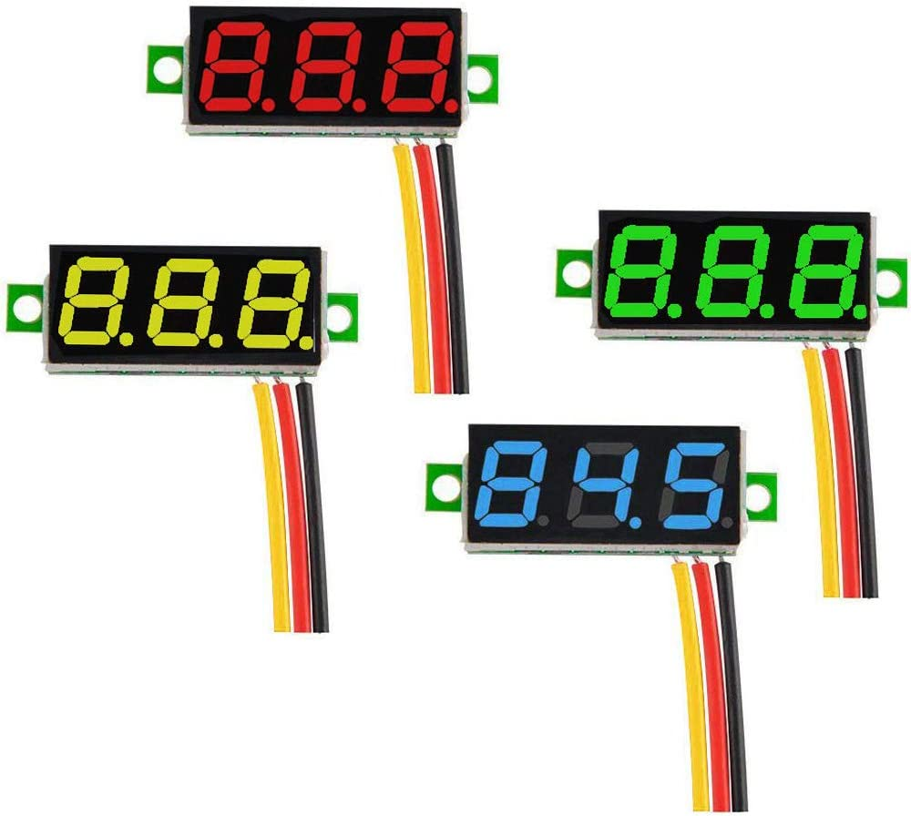

++++++++++++++++++++++++++++++++++++++++++++++++++++++++++++++++++++++++++++++++++++++++++++++++++++
Mes réalisations
++++++++++++++++++++++++++++++++++++++++++++++++++++++++++++++++++++++++++++++++++++++++++++++++++++

:Auteur: J.Soranzo
:Date de création: 02/2022
:Date dernière maj: 13/03/2022
:Societe: VoRoBoTics
:Entity: VoLAB

.. |clearer|  raw:: html

   

.. contents::
    :backlinks: top

====================================================================================================
Réalisés
====================================================================================================

.. image:: images/realises01.jpg 
   :width: 800 px

De la gauche vers la droite : module tension/courant, USB 5V 3A, Oscillo, Alimentation stabilisé, re USB 5V 33A

Manque sur la photo : Voltmètre/ampèremètre, triple tinyVoltmètre

====================================================================================================
Règles de nommage
====================================================================================================
- nom du fichier = nom de l'objet (de préférence sa vrai référence)
- chaque objet à un part
- chaque part à **SA** spreadsheet cela permet d'avoir plusieurs fois le même terme (ex: long, larg)
- spreadsheet = nomDeLObjetSp (permet d'identifier les spreadsheet parmi d'autres noms)
- un diamètre = diam
- une longueur = long
- une largeur = larg
- une hauteur = haut
- une épaisseur = ep
- un entraxe = entraxe
- une distance entre 2 points = dist
- on ne répète pas le nom de l'objet dans les éléments de la spreadsheet
- On suffixe en commençant par le plus générique
- posX et posY font référence à la manière dont le scketch s'affiche de base X axe des abscisses 
  Y celui des ordonnées (indépendant du repère XYZ de l'espace 3D de FreeCAD)

exemples:

- *bornSp.bornierVisTrouDiam* est incorrecte, alors que *bornierSp.VisTrouDiam* serait correcte
- suffixe : VisTrouDiam, VisTrouPosX....

====================================================================================================
Versionning
====================================================================================================
Pas de git pour ce projet !
les versions soit 3 digits soit 3 digits. 1 sous version. Je suis indécis. J'aurais tendance à tendre
vers 3 digits seuls (ça fait moins de caractères à taper)

Passage sous git le 17/04/22 : on perd la notion de version numérotée. On peut s'en sortir avec le 
hash du commit mais ce passage sous git va de paire avec le passage à des références dans freecad
pour ne pas avoir de nom de référence qui change tout le temps...

====================================================================================================
Le model de base 35mm large
====================================================================================================
Modèle
----------------------------------------------------------------------------------------------------
J'ai entièrement repris le modèle de base sous Freecad avec spreadsheet paramétrable.

Face avant détachable & ventilation. Fortement inspiré du model de Cordless

ajout également d'une vis pointeau sous les XT60

Insert filetés
----------------------------------------------------------------------------------------------------
`Sur AMAZON ruthex Boîte M2 + M3 + M4 + M5 insert fileté`_

.. _`Sur AMAZON ruthex Boîte M2 + M3 + M4 + M5 insert fileté` : https://www.amazon.fr/gp/product/B08K1BVGN9/ref=ppx_yo_dt_b_asin_title_o06_s00?ie=UTF8&psc=1

.. image:: images/ruthexBox.JPG 
   :width: 300 px

Dimensions:

Calculs relatifs à la ventilation
----------------------------------------------------------------------------------------------------
Calculer le nombre de fentes.

On connaît:

- la largeur du modules
- l'épaisseur de la parois
- la largeur des fentes
- l'écart entre les fentes

On veut le nombre de fentes et la longeur de la répétission

En effet dans Freecad, il faut ces 2 paramètres::

   grandA =(largeurModuleBase - 2 * epaisseurParois) / 2
   ventilLargeurRepet =grandA - ventilEcartfente / 2 - (ventilLargeurFentes + ventilEcartfente)
   ventilNbrFents =ceil(ventilLargeurRepet / (ventilLargeurFentes + ventilEcartfente)) + 1

.. image:: images/ventilCalculsFentes.svg
   :width: 500 px

Profile
----------------------------------------------------------------------------------------------------

.. image:: images/profileOriginal.JPG 
   :width: 300 px

.. image:: images/profileOriginalXT60.JPG  
   :width: 300 px

Côtes XT60 mauvaise :

- largeur = 8
- largeur du sommet = 3

Juste :

- hauteur = 15.75 mais  affaissement des couche d'impression à compenser
- le 13.25

.. image:: images/profilesFav.svg 
   :width: 600 px

|clearer|

.. image:: images/moduleDeBaseSousFreecad.jpg 
   :width: 600 px

|clearer|

.. index::
    single: Switch

Switch ON/OFF
----------------------------------------------------------------------------------------------------
J'ai eu la chance de récupérer un carton entier de ces switch donc, je les utilise. Libre à vous de 
changer.

Toujours est-il que voici la référence pour les flemmards : chez `Farnell C1500ATAAA`_

.. _`Farnell C1500ATAAA` : https://fr.farnell.com/arcolectric/c1500ataaa/interrupteur-a-bascule-spst-noir/dp/150549?st=c1500

Fabrcant ARCOLECTRIC (BULGIN LIMITED).

:download:`datasheet C1500<fichiersJoints/C1500AT_2711451.pdf>`

.. image:: images/c150AA.jpg 

Cette version est assez encombrante 14x30mm. Mais c'est celle que je choisi de base car j'en ai 
2 cartons pleins :-()

Autre version plus petite 15x10 malheureusement ceux que j'ai commander sur amazon devaient mesurer
20x10 et à l'arrivée ils sont plus petits mais du coup ça peut être utile.

.. index::
    single: XT60

XT60
----------------------------------------------------------------------------------------------------
Sur AMAZON facile à trouver par exemple `AUTOUTLET 20 PCS 10 Paires XT60`_

.. _`AUTOUTLET 20 PCS 10 Paires XT60` : https://www.amazon.fr/gp/product/B07C3R5W31/ref=ppx_yo_dt_b_asin_title_o08_s00?ie=UTF8&th=1

.. image:: images/xt60.jpg 
   :width: 300 px

Nomenclature de base
----------------------------------------------------------------------------------------------------
.. csv-table:: Nomenclature Module de base hors pièces imprimées
   :file: ../../_02-realisation/_03-cao_3D/mesCreations/base35mmParam/nomBASE.csv
   :delim: ,
   :encoding: UTF-8
   :align: left
   :header-rows: 1

====================================================================================================
Alimentation des modules en plus base tension
====================================================================================================
Pour les modules qui en ont besoin !

.. _moduleDCDC2596:

Module convertisseur réglable 2A
----------------------------------------------------------------------------------------------------
Ce convertisseur est nécessaire quand les éléments du module ne supportent pas des tension d'entrées
comprise entre 15 et 24V.

Il convient alors de régler la tension de sortie du convertisseur à la bonne valeur

Convertisseur DC/DC 1A réglable

Alimentation du rail : 19 à 25V environ

Courant de sortie nominal annoncé : 2A

Ce style de DCDC: 

.. image:: images/dcdc2Areglable.jpg 
   :width: 300 px

13.57€ par 10pcs chez `Banggood lm2596 DC-DC`_

.. WARNING:: Pb avec le model 3D récup sur GARCAD
   :class: without-title

   Écart entre trou mesuré : 31mm versus 30.26 sur le step

.. image:: images/DCDC2596ModelPb.JPG 
   :width: 600 px

.. _`Banggood lm2596 DC-DC` : https://www.banggood.com/fr/10Pcs-LM2596-DC-DC-Adjustable-Step-Down-Power-Supply-Module-p-963307.html?rmmds=detail-left-hotproducts__7&cur_warehouse=CN

Uin : 35V max

Uout : de 1.35V à 35V mouais !

pb la fixation: 2 trous M3 mais:

.. WARNING:: ATTENTION Mettre des vis nylon : risque de contact avec un broche de capa 

`VIS M3x6 NYLON AMAZON`_

.. _`VIS M3x6 NYLON AMAZON` : https://www.amazon.fr/Maintient-Casquette-Convient-nombreux-endroits/dp/B097P43SJC/ref=sr_1_19?keywords=vis+nylon&qid=1649422582&sr=8-19

.. image:: images/positionnementDCDC.jpg 
   :width: 300 px

Tige laiton (connexion des XT60)
----------------------------------------------------------------------------------------------------

Tige en laiton diam 2 pour les rails chez Leroymerlin diam 3 (le mieux serait du 2)

ou manomano tous les diamètre ou chez `AMAZON 20 Pièces T2 Baguettes de Soudage en laiton de 2mm x 250mm`_

.. _`AMAZON 20 Pièces T2 Baguettes de Soudage en laiton de 2mm x 250mm` : https://www.amazon.fr/gp/product/B08S728MMZ/ref=ppx_yo_dt_b_asin_title_o01_s01?ie=UTF8&psc=1

.. figure:: images/tigeLaitons.jpg
    :width: 300 px
    :align: left

    Position des tiges en laiton

20 tiges de 250mm 14€ soit 0.7€ les 250mm

====================================================================================================
Module primaire
====================================================================================================
AC/DC adaptateur :

.. image:: images/emboutPowerPC.jpg 
   :width: 600 px

- prise pc DELL, diamètre extérieur mesuré: 7.4mm

- prise MSI : diamètre extérieur 7.4mm, même adaptateur pour les TS-100 que pour DELL

- prise alim Toshiba ADP-75SB BB
    - diamètre extérieur 5.5
    - diamètre tige intérieur : 2.7mm voir 2.8difficile à mesurer
    - `Embase verte du LAB à vis`_ conviennent, l'âme 2mm environ chez AMAZON5.5x2.1 DC5520

- Prise male pour le TS100 : l'âme centrale semble plus grosse ci bien que la prise TOSHIBA avec
  lame de ressort convient mais pas les verte du LAB. Serait : Port DC5525 5.5x2.5.
  Chez `AMAZON DC5525`_

N'ayant pas trouvé simplement d'embase 7.4x5.0mm j'opte pour un adaptateur vers 5.5x5.2 encore du 
`AMAZON Kafuty 5PCS 7.4 x 5.0 x 0.6MM Connecteur d'adaptateur d'alimentation`_

.. _`AMAZON Kafuty 5PCS 7.4 x 5.0 x 0.6MM Connecteur d'adaptateur d'alimentation` : https://www.amazon.fr/gp/product/B084Z6YDCV/ref=sw_img_1?smid=A1U9HA371QAC83&psc=1
  
Donc en résumé pour ce module : 1 XT-60 normal + à l'arrière ou du même côté que le XT ou les 2:

- DC5025
- `DC5020`_

.. _`Embase verte du LAB à vis` : https://www.amazon.fr/Connecteur-femelle-verser-cam%C3%A9ra-surveillance/dp/B00Z2LMT2O/ref=sr_1_11?__mk_fr_FR=%C3%85M%C3%85%C5%BD%C3%95%C3%91&crid=1TMH52S91RFIR&keywords=DC5521&qid=1651395134&sprefix=dc5521%2Caps%2C50&sr=8-11

.. _`AMAZON DC5525` : https://www.amazon.fr/gp/product/B01LQGESUO/ref=ox_sc_act_title_2?smid=AQ1IBDB6G2RRD&psc=1

.. _`DC5020` : https://www.amazon.fr/gp/product/B07D4DLJ69/ref=ox_sc_act_title_1?smid=A2HAOQPNQ6T9Y5&psc=1 

.. index::
    pair: Modules; U/I en ligne

====================================================================================================
Module mesure Tension/courant de la ligne
====================================================================================================

.. image:: images/uimodule.JPG 
   :width: 600 px

.. image:: images/uiWatmetreAmazon.jpg 
   :width: 300 px

Le but de ce module est d'indiquer la tension et le courant consommé par les modules qui se trouvent
après lui dans la chaîne. C'est le seul module qui n'est pas en parallèle.

.. index::
    pair: Outillages; XT60

====================================================================================================
Outillage pour souder les XT60
====================================================================================================
Voici un outillage permettant de souder les tiges laiton aux XT60 au bonnes dimensions.

.. image:: images/outillageXT.jpg 
   :width: 600 px

Il suffit de régler la partie de droite à la largeur du module considéré.

Il y est équipé d'un réglet disponible chez Castorama

Largeur : 24mm +/-1 et moins de 1mm d'épaisseur

toto

.. index::
    pair: Modules; USB 3A

====================================================================================================
USB 5V 3A : ECHEC les modules ne tiennent pas 24V en entrée
====================================================================================================
Convertisseurs: `ANGEEK Lot de 5 modules d'alimentation USB DC 6-24 V à 5 V 3 A`_ chez AMAZON 10€/5

.. _`ANGEEK Lot de 5 modules d'alimentation USB DC 6-24 V à 5 V 3 A` : https://www.amazon.fr/gp/product/B07Q7TTD6C/ref=ppx_yo_dt_b_asin_title_o00_s01?ie=UTF8&psc=1

.. image:: images/module5V3ASurAMAZON.jpg 
   :width: 600 px

.. WARNING:: 24V max en entrée !!!!
   :class: without-title

Nomenclature
----------------------------------------------------------------------------------------------------
.. csv-table:: Nomenclature USB5V 3A
   :file: ../../_02-realisation/_03-cao_3D/mesCreations/moduleUSB3A/nomUSB3A.csv
   :delim: ,
   :encoding: UTF-8
   :align: left
   :header-rows: 1

.. _refOscilloRealisation:

.. index::
    pair: Modules; Oscilloscope

====================================================================================================
Module oscillo 1 voies DSO138
====================================================================================================
.. WARNING:: REGLER LA TENSION DE SORTIE DU DCDC à 9V sinon ça chauffe
   :class: without-title

   ici 9V

.. _`NOUVEAU JYETech® 13805K DSO138 Mini Oscilloscope Numérique 200KHz` : https://www.banggood.com/fr/NEW-JYETech-13805K-DSO138-Mini-200KHz-Digital-Oscilloscope-SMD-Soldered-Version-DC3_5V-6V-With-Housing-p-1627586.html?utm_source=googleshopping&utm_medium=cpc_organic&gmcCountry=FR&utm_content=minha&utm_campaign=minha-fr-fr-pc&currency=EUR&cur_warehouse=CN&createTmp=1&utm_source=googleshopping&utm_medium=cpc_union&utm_content=sandra&utm_campaign=sandra-ssc-fr-css-all-0423-19bf-v2&ad_id=344815794167&gclid=CjwKCAiAx8KQBhAGEiwAD3EiP3yN54JABv3-oe_jhIRZ2Zv9rc89praeH_G5VnR0Qqd3OnVhP0iA_hoC_KoQAvD_BwE

.. image:: images/oscilloAmazon.jpg 
   :width: 600 px

Sur AMAZON `ARCELI Oscilloscope numérique au Format de Poche, kit Open Source TFT 2,4 Pouces avec sonde, Version assemblée (soudé)`_ à 27€

.. _`ARCELI Oscilloscope numérique au Format de Poche, kit Open Source TFT 2,4 Pouces avec sonde, Version assemblée (soudé)` : https://www.amazon.fr/gp/product/B07V67LYXF/ref=ppx_yo_dt_b_asin_title_o01_s00?ie=UTF8&psc=1

Attention plusieurs versions différentes même sur le site JYE Tech

`NOUVEAU JYETech® 13805K DSO138 Mini Oscilloscope Numérique 200KHz`_ chez BANGGOOD (vue assemblée)

.. image:: images/dso138mini.jpg 
   :width: 300 px

Dimension: 85mm X 75mm X 15mm

La version la plus stable serait la `JYE Tech DSO138mini`_ plus compact et aussi plus cher. 
Pas trouvé assemblée sur AMAZON

.. _`JYE Tech DSO138mini` : https://jyetech.com/dso138mini-oscilloscope-diy-kit/

BNC : code RS :  680-7371, modèle directement récupérer et mis en fichier Freecad.

:download:`Drawing<fichiersJoints/bnc_drawing_0900766b80d9b202.pdf>`

.. image:: images/bncMountingHole.jpg 
   :width: 300 px

.. WARNING:: REGLER LA TENSION DE SORTIE DU DCDC à 9V sinon ça chauffe
   :class: without-title

   Ici 9V cf. `Alimentation des modules en plus base tension`_

Oscillo schéma de câblage
----------------------------------------------------------------------------------------------------

.. image:: images/oscillosch_220504_1808.svg 
   :width: 600 px

Rendu FreeCad
----------------------------------------------------------------------------------------------------
.. image:: images/oscillo.jpg 
   :width: 600 px

Nomenclature oscillo DSO138
----------------------------------------------------------------------------------------------------
.. csv-table:: Nomenclature oscilloscope DSO138
   :file: ../../_02-realisation/_03-cao_3D/mesCreations/moduleOscillo/nomOscillo.csv
   :delim: ,
   :encoding: UTF-8
   :align: left
   :header-rows: 1

.. index::
    pair: Modules; Alim

====================================================================================================
Alimentation stabilisé DPS3005
====================================================================================================
DPS3005
----------------------------------------------------------------------------------------------------
Éléments mécaniques
****************************************************************************************************

`Sur AMAZON DollaTek DPS3005`_ mais aussi sur ebay `DP20V2A 30V5A 50V5A DC32V/3A DPS3003 Programmable Step-down Power Supply Module`_

.. _`DP20V2A 30V5A 50V5A DC32V/3A DPS3003 Programmable Step-down Power Supply Module` : https://www.ebay.fr/itm/173505693618?mkevt=1&mkcid=1&mkrid=709-53476-19255-0&campid=5338765827&toolid=20006&customid=FR_12576_173505693618.133461549755~1597688752702-g_CjwKCAjw3cSSBhBGEiwAVII0Zw5sQiVouWsO5nVVTwOw-ZJhONAWM9nyral4nl8BqnXoW3bqRb2HxhoCokkQAvD_BwE

 et aliexpress

.. _`Sur AMAZON DollaTek DPS3005` : https://www.amazon.fr/gp/product/B07PLFZ3H2/ref=ppx_yo_dt_b_asin_title_o09_s01?ie=UTF8&psc=1

|clearer|

.. image:: images/DPS3005_domensions.jpg 
   :width: 300 px

Software
****************************************************************************************************
Ce module peut être piloter en USB, il est fourni avec un carte d'interface.

`TheHWcave Controlling a DPS5005 power supply module`_

.. _`TheHWcave Controlling a DPS5005 power supply module` : https://www.youtube.com/watch?v=7sy249Ikzvc

Avec exemple de code en Python sous `github DPS5005-control`_

.. _`github DPS5005-control` : https://github.com/TheHWcave/DPS5005-control

Fiches bananes
----------------------------------------------------------------------------------------------------

.. image:: images/ficheBananeRSNoire.jpg 
   :width: 300 px

|clearer|

.. image:: images/ficheBananeRSRougeNoirLowCost.jpg 
   :width: 300 px
   

Avec :download:`la datasheet<fichiersJoints/dtsFichesBananes_A700000006792413.pdf>`

.. image:: images/ficheBananeRSRougeNoirLowCost_mountingHole.jpg 

Connecteurs Audio
----------------------------------------------------------------------------------------------------
Utilisation de connecteurs audio pour avoir des connections rapides.

.. figure:: images/connecteursAudio.jpg
    :width: 300 px
    :align: left

    Connecteurs audio  

Disponibles un peu partout sur internet mais ceux que j'ai utilisés pour la modélisation proviennent 
d'`Amazon Bornier 2 Voies pour Enceinte Haut Parleur`_

.. _`Amazon Bornier 2 Voies pour Enceinte Haut Parleur` : https://www.amazon.fr/gp/product/B082TM9QXK/ref=ppx_yo_dt_b_asin_title_o04_s00?ie=UTF8&psc=1 

Rendu final sous Freecad
----------------------------------------------------------------------------------------------------

Nomenclature module DPS3005
----------------------------------------------------------------------------------------------------
.. csv-table:: Nomenclature DPS3005
   :file: ../../_02-realisation/_03-cao_3D/mesCreations/moduleAlimStabDPS3005/nomDPS3005.csv
   :delim: ,
   :encoding: UTF-8
   :align: left
   :header-rows: 1

.. index::
    pair: Modules; Volt/ampèremètre

====================================================================================================
Voltmètre /ampèremètre
====================================================================================================

.. figure:: images/voltAmpereWiring_51KumhqfJfL.jpg
    :width: 300 px
    :align: left

    Volt ampère schéma de câblage initial 

|clearer|

`How to Make a Digital Voltmeter and Ampere Meter at Home - Homemade Myltimeter`_ On Youtube

.. _`How to Make a Digital Voltmeter and Ampere Meter at Home - Homemade Myltimeter` : https://www.youtube.com/watch?v=vPSaLIBBoh4

.. figure:: images/va_wiring.svg 
   :width: 300 px
   :align: left

   Câblage interne et utilisation

|clearer|

.. figure:: images/VAInWork.jpg
    :width: 600 px
    :align: left

    Module Volt ampère première utilisation 

Rendu Freecad
----------------------------------------------------------------------------------------------------

.. image:: images/moduleVA.jpg 
    :width: 300 px
    :align: left

|clearer|

.. index::
    pair: Modules; GénéBF

====================================================================================================
Gene de signal
====================================================================================================
Préliminaire
----------------------------------------------------------------------------------------------------
`Générateur de Signal XR2206 1Hz -1MHz`_

.. _`Générateur de Signal XR2206 1Hz -1MHz` : https://fr.aliexpress.com/item/32862689682.html?gatewayAdapt=glo2fra&spm=a2g0o.detail.1000023.2.14c435deWAoz2w

XR2206 : :download:`datasheet<fichiersJoints/xr2206_datasheet.pdf>`

Sur Instructable `DIY Function/Waveform Generator`_

.. _`DIY Function/Waveform Generator` : https://www.instructables.com/DIY-FunctionWaveform-Generator/

Base AD9833 :download:`datasheet<fichiersJoints/ad9833.pdf>`

.. image:: images/schOriginalGenFunc.png 
   :width: 600 px

Maquettage
----------------------------------------------------------------------------------------------------

L'instructable à base d'ARDUINO NANO et d'AD9833 me parait bien. 

Appro breakout board 9833 ok

Ampli OP dans le design original : TL071

Maquetter avec un OPA284 ou 184 ou 484 ceux dispo au lab. Single supply jusqu'à 36V ;-)

Si non un dc/dc +15/-15V, sur AMAZON: 

`Niiyen Module élévateur, convertisseur élévateur CC 3.3 V-13 V à + 15 V/-15 V, convertisseur élévateur`_

.. _`Niiyen Module élévateur, convertisseur élévateur CC 3.3 V-13 V à + 15 V/-15 V, convertisseur élévateur` : https://www.amazon.fr/gp/product/B093PSZPW6/ref=crt_ewc_title_dp_1?ie=UTF8&psc=1&smid=A3MM3V4F4Z0CQN

un potar de gain et un d'offset, on pourait ajouter une relecture sur l'écran pour controler.

Ajouter l'interrupteur ofset au GND comme sur le design original.

Reverse du code
----------------------------------------------------------------------------------------------------
une fonction debounce bof.

un handler d'it qui fait beaucoup

Un switch case pour gérer les menu.

Modélisation 3D
----------------------------------------------------------------------------------------------------
- 3D écran
- 3D nano (pas utile puisque pcb dédié) si en fait pour les volumes en attendant le pcb
- 3D boutons
- 

KICAD project started.

.. index::
    pair: Modules; PARKSIDE

====================================================================================================
Module Parkside
====================================================================================================
Recherche de model internet : pas grand chose d'exploitable, surtout des stl !

Mieux vaut tout re-modéliser ça n'a pas l'air très compliqué si on s'inspire du chargeur !

====================================================================================================
Module triple tiny voltmètre
====================================================================================================
2.4 to 30V 0.28" chez Banggood Aliexpress ou 

`AMAZON YIXISI 4pcs Mini Voltmètre Numérique, 0.28 Pouce Deux Lignes DC Voltmètre, 4 Couleurs Rouge/Jaune/Vert/Bleu`_

.. _`AMAZON YIXISI 4pcs Mini Voltmètre Numérique, 0.28 Pouce Deux Lignes DC Voltmètre, 4 Couleurs Rouge/Jaune/Vert/Bleu` : https://www.amazon.fr/YIXISI-Voltm%C3%A8tre-Num%C3%A9rique-Lignes-Couleurs/dp/B082ZLRY1Y/ref=asc_df_B082ZLRY1Y/?tag=googshopfr-21&linkCode=df0&hvadid=411439987151&hvpos=&hvnetw=g&hvrand=12753950135123075235&hvpone=&hvptwo=&hvqmt=&hvdev=c&hvdvcmdl=&hvlocint=&hvlocphy=9056228&hvtargid=pla-864257550626&psc=1&tag=&ref=&adgrpid=95238321811&hvpone=&hvptwo=&hvadid=411439987151&hvpos=&hvnetw=g&hvrand=12753950135123075235&hvqmt=&hvdev=c&hvdvcmdl=&hvlocint=&hvlocphy=9056228&hvtargid=pla-864257550626

Rendu FreeCAD
----------------------------------------------------------------------------------------------------

.. index::
    pair: Modules; Ventilo

====================================================================================================
Module ventilo
====================================================================================================
Diamètre ventilateur 8cm, souhait : inclinable avec éclairage à LED et filtre

Conception du système d'inclinaison
----------------------------------------------------------------------------------------------------
Conception du système d'inclinaison, les différentes versions :

- avec demi bille et lame de ressort imprimée : KO trop peu précis
- avec aimant : presque mais... aimants difficiles à manipuler et pas assez puissants
- languette et poignée sur le côté : prometteuse (retenue pour le moment)

.. |langBille| image:: images/moduleVentiloVersionlanguetteBille.JPG
   :width: 200 px

.. |aimants| image:: images/moduleVentiloVersionAimants.JPG
  :width: 300 px

.. list-table::
   :widths: 27 27 
   :header-rows: 1

   * - languette et bille imprimée
     - Version avec aimants

   * - |langBille|
     - |aimants|

.. _pilotageLedVentilo:

Pilotage éléectrique du ventilo et des LED
----------------------------------------------------------------------------------------------------

.. image:: images/potarAvecOnOff.jpg 
   :width: 300 px

`Potentiomètre Rotatif avec Interrupteur chez AMAZON`_

.. _`Potentiomètre Rotatif avec Interrupteur chez AMAZON` : https://www.amazon.fr/gp/product/B096NXK7L1/ref=ox_sc_act_title_1?smid=A2W68NJA5YNXUP&psc=1

Abandon de l'idée du potar avec inter car l'inter n'est pas cliquable mais s'active en bout de rotation
si bine que cela ne permet pas de concerner le réglage. Donc retour à une version avec switch séparé
cela tombien j'en ai des petit 10x5.

Un simple potentiomètre seul ne convient pas car la tension d'entrée peut varier de 12 à 24V.

On est obligé de passer par un régulateur et comme on veut que cela soit variable, il convient de 
limiter le module LM2596S à 12V max en sortie et de déporter le potar

:download:`datasheet du LM2596S<fichiersJoints/lm2596s_dts.pdf>` qui équipe les modules choisi
:ref:`voir ici<moduleDCDC2596>`

.. image:: images/lm2596sextraitdtsCalculR1R2sch.jpg 
   :width: 800 px

Pour du 12v avec R1 1k on a:

1k * ( 12/1.23 - 1 ) = 8.75k

admettons qu'on veuille aller jusqu'à 14V, il faudrait 10.4K pour R2.

D'après l'équation (1) si R1 augmente Vout diminiue mais R1 doit être comprise entre 240 et 1.5k 
pas 10k comment les modules fonctionnent ?

Une piste:

.. image:: images/LM2596S-Schematic.jpg 
   :width: 600 px

Visiblement sur mes modules R1 = 270ohm

vout à 10k = 1.23 * ( 1 + R2/R1) = 1.23 * ( 1 + 10/0.27) = 46V !

vout à 100ohm = 1.23 * ( 1 + 100/270 ) = 1.68V

Pour du 14 en sortie : 0.27 * ( 14 / 1.23 -1 ) = 2.8k max  et pas 13805K

Solution une zener 12V en sortie pour écrêter:

R = 24v - 12v / 0.1A environ 120ohm P=1.2W bof ! 5 résistance 1/4W en //

Revoir le courant 20mA par groupe de 4 led 4 groupe 80mA refaire les calculs.

Avec un digispark
----------------------------------------------------------------------------------------------------
:download:`Schema digispark<fichiersJoints/DigisparkSchematicFinal.pdf>`

`Description sur le site`_ Pas fcaile à trouver !

.. _`Description sur le site` : http://digistump.com/wiki/digispark/tutorials/digispark

Pour le PWM et analogRead tout sur une `seule page sur le wiki digistump`_

.. _`seule page sur le wiki digistump` : http://digistump.com/wiki/digispark/tutorials/basics

Attiny85 10bits ADC

|clearer|

.. image:: images/2n700courant.jpg 

le 2n700, c'est la première colonne donc 200mA en continu et 500 en pulse.

:download:`2N7000 datasheet<fichiersJoints/2N7000.pdf>`

4 LED en // 80mA et le ventilo donné pour 0.33A mesuré 167mA sous 14V

Transistor en D2PAK NTD20N03L27 20A ou 
:download:`IPD079N06L datasheet<fichiersJoints/Infineon-IPD079N06L3-DS-v02_00-en.pdf>`
composants que j'avais sous la main mais un cananl N capable de driver 500mA à 1A suffit !

.. image:: images/ipd079N06pinout.jpg 
   :width: 300 px

.. WARNING:: Encore un échec ! le ventilateur siffle quand il est piloté en pwm. Pour les LED c'est OK
   :class: without-title

Essais d'un ventilo avec pwm : à voir ventilateur commandé sur AMAZON :download:`pure wing2 dts<fichiersJoints/Datasheet_Pure-Wings2_PWM_en.pdf>`
Il n'est pas dit la frequence à laquelle, il faut piloter ce ventilo, on parle sur les doc de carte mère de 15 à 20kHz.

Changer la fréquence du PWM dans le digispark
****************************************************************************************************
`Digispark tricks`_

.. _`Digispark tricks` : http://digistump.com/wiki/digispark/tricks

`Trying to increase PWM frequency`_ sur le forum Digispak

.. _`Trying to increase PWM frequency` : http://digistump.com/board/index.php?topic=2312.0

Un peu plus éloigné : `ATTiny85 PWM frequency selection`_

.. _`ATTiny85 PWM frequency selection` : https://forum.arduino.cc/t/attiny85-pwm-frequency-selection/60785/5

Attention les canaux analogiques ne sont pas numéroté de manière logique.

Voir `Digistump basics`_

.. _`Digistump basics` : http://digistump.com/wiki/digispark/tutorials/basics

::

   sensorValue = analogRead(1); //Read P2
   //To set to input: pinMode(2, INPUT);
   //THIS IS P2, P2 is analog input 1, so when you are using analog read, you refer to it as 1.

   //sensorValue = analogRead(2); //Read P4
   //To set to input: pinMode(4, INPUT);
   //THIS IS P4, P4 is analog input 2, so when you are using analog read, you refer to it as 2.

   //sensorValue = analogRead(3); //Read P3
   //To set to input: pinMode(3, INPUT);
   //THIS IS P3, P3 is analog input 3, so when you are using analog read, you refer to it as 3.

   //sensorValue = analogRead(0); //Read P5
   //To set to input: pinMode(5, INPUT);
   //THIS IS P5, P5 is analog input 0, so when you are using analog read, you refer to it as 0.

====================================================================================================
Module ampèremètre
====================================================================================================
`High Precision Ammeter - Amber`_ sur PC Board.ca 11.90 $ sans les frais de port

Sur AMAZON : peu de choix : `Harilla DC 3.5-30V 5 Digit Digital LED Ampèremètre Ampèremètre Panneau Car - Jaune`_
et 22€ pas en prime !

Tellement fun un ampèremètre continu à aiguille : 

`Mini-ampèremètre analogique  2.5 Précision Ampèremètre (DC 0-5A)`_ là encore pas énormémet de choix
15.47€

.. image:: images/amperemetreDigitalPrecision_51c1JswDGgL._AC_SL1024_.jpg 
   :width: 300 px

`Version 3A CC`_ 10.39€

`En version AC 0-5A`_

.. _`High Precision Ammeter - Amber` : https://www.pcboard.ca/digital-ammeter-high-precision-amber

.. _`Harilla DC 3.5-30V 5 Digit Digital LED Ampèremètre Ampèremètre Panneau Car - Jaune` : https://www.amazon.fr/Harilla-3-5-30V-Digital-Amp%C3%A8rem%C3%A8tre-Panneau/dp/B08R34SXPH/ref=sr_1_23?__mk_fr_FR=%C3%85M%C3%85%C5%BD%C3%95%C3%91&crid=3SWMM4HKE1BQB&keywords=Digital+amperemetre&qid=1649549353&sprefix=digital+amperemetre%2Caps%2C100&sr=8-23

.. _`Mini-ampèremètre analogique  2.5 Précision Ampèremètre (DC 0-5A)` : https://www.amazon.fr/Mini-amp%C3%A8rem%C3%A8tre-analogique-Professionnel-Pr%C3%A9cision-Amp%C3%A8rem%C3%A8tre/dp/B07RSQDQB4/ref=sr_1_5?__mk_fr_FR=%C3%85M%C3%85%C5%BD%C3%95%C3%91&crid=3FHEH37LOASTV&keywords=pr%C3%A9cision%2Bamp%C3%A8rem%C3%A8tre%2Bpanneau&qid=1650790527&sprefix=pr%C3%A9cision%2Bamp%C3%A8rem%C3%A8tre%2Bpanneau%2B%2Caps%2C57&sr=8-5&th=1

.. _`Version 3A CC` : https://www.amazon.fr/Heschen-85-C1-3-rectangle-Panneau-Amp%C3%A8rem%C3%A8tre/dp/B072BNXHM2/ref=sr_1_18?__mk_fr_FR=%C3%85M%C3%85%C5%BD%C3%95%C3%91&crid=25ULUI5QE2J55&keywords=pr%C3%A9cision%2Bamp%C3%A8rem%C3%A8tre%2Bpanneau&qid=1650820644&sprefix=pr%C3%A9cision%2Bamp%C3%A8rem%C3%A8tre%2Bpanneau%2Caps%2C106&sr=8-18

.. _`En version AC 0-5A` : https://www.amazon.fr/Classe-pr%C3%A9cision-Analogique-0-5A-gamme-Panneau/dp/B009PKGQZY/ref=sr_1_43?__mk_fr_FR=%C3%85M%C3%85%C5%BD%C3%95%C3%91&crid=25ULUI5QE2J55&keywords=pr%C3%A9cision%2Bamp%C3%A8rem%C3%A8tre%2Bpanneau&qid=1650820644&sprefix=pr%C3%A9cision%2Bamp%C3%A8rem%C3%A8tre%2Bpanneau%2Caps%2C106&sr=8-43

====================================================================================================
Weblinks
====================================================================================================

.. target-notes::