++++++++++++++++++++++++++++++++++++++++++++++++++++++++++++++++++++++++++++++++++++++++++++++++++++
Module alimentation primaire à base de batterie PARKSIDE de chez LIDL
++++++++++++++++++++++++++++++++++++++++++++++++++++++++++++++++++++++++++++++++++++++++++++++++++++

:Projet: Tiny e-lab
:Auteur: J.Soranzo
:Date de création: 10/2022
:Date dernière maj: 10/2022
:Societe: VoRoBoTics
:Entity: VoLAB

.. |clearer|  raw:: html

   

.. index::
    pair: Modules; PARKSIDE

====================================================================================================
Module Parkside X20
====================================================================================================
Recherche de model internet : pas grand chose d'exploitable, surtout des stl !

Mieux vaut tout re-modéliser ça n'a pas l'air très compliqué si on s'inspire du chargeur !

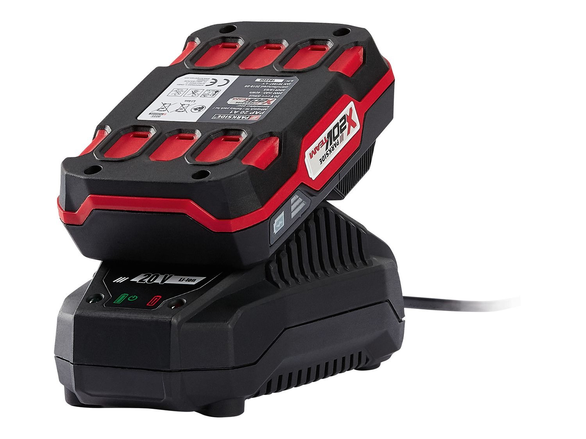

====================================================================================================
Un peu d'électronique
====================================================================================================
Le composant principal est un LGT8P30 : pas trouvé la datsheet. Et un LGT8P22 côté chargeur.

Le design a l'air très sain.

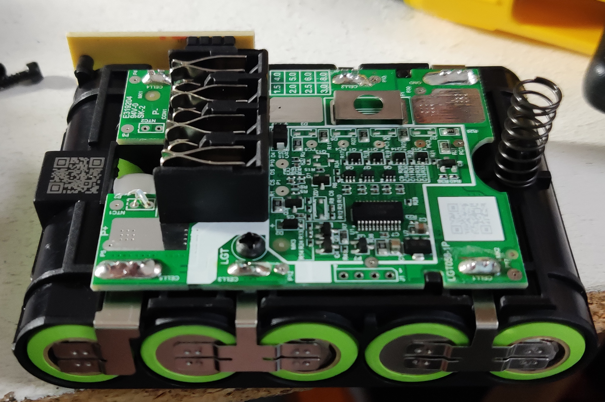

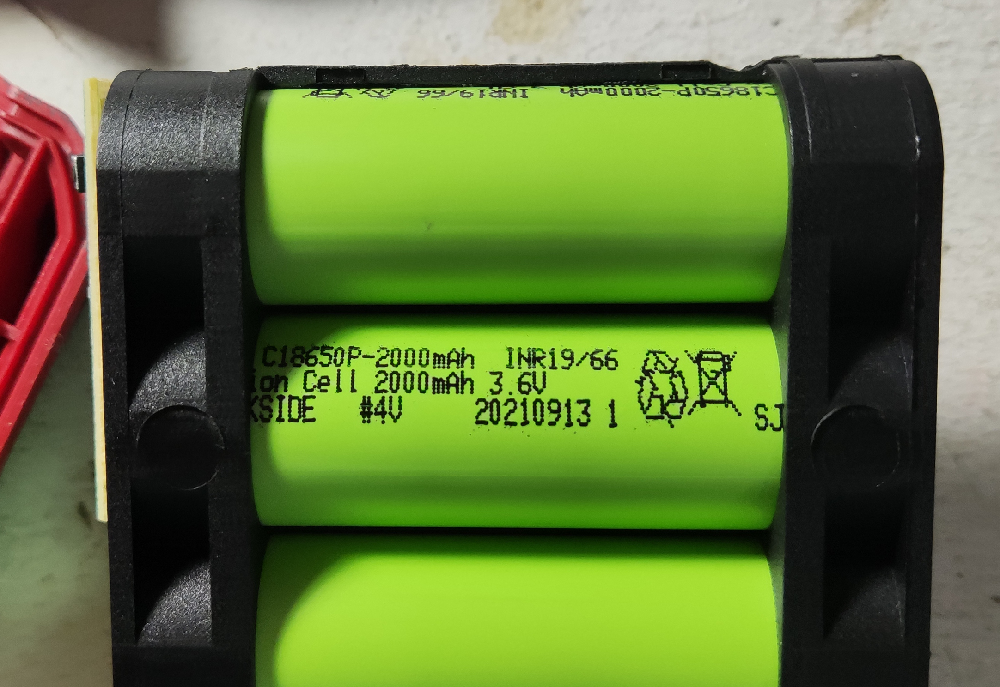

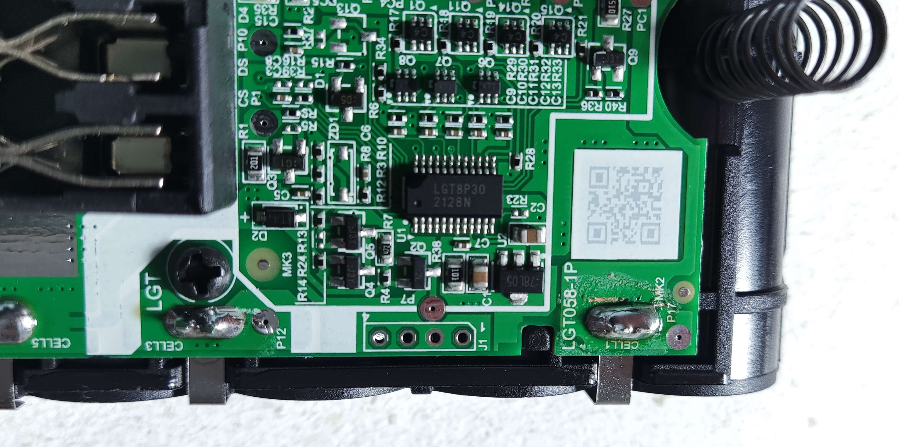

.. list-table::
   :widths: 27 27 27
   :header-rows: 1

   * - Pack vue d'ensemble
     - Un élément 2000mHA 3.6V
     - le contrôleur LGT8P30

   * - |pks_Image1|
     - |pks_Image2|
     - |pks_Image3|

Les 5 éléments sont montés en série soir 5x3.6V = 18V de tension nominale... Pas 20V.

|clearer|

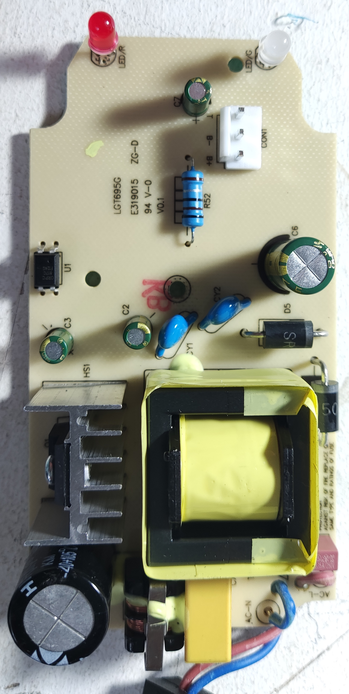

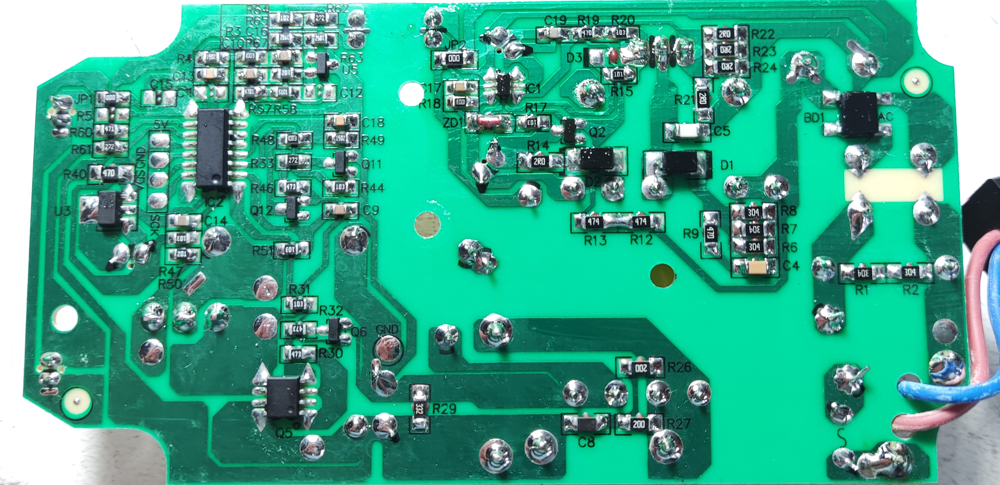

.. list-table::
   :widths: 27 27
   :header-rows: 1

   * - Chargeur côté "composant"
     - Chargeur côté "soudure" lol

   * - |pks_Image4|
     - |pks_Image5|

====================================================================================================
Rendu Frecad
====================================================================================================

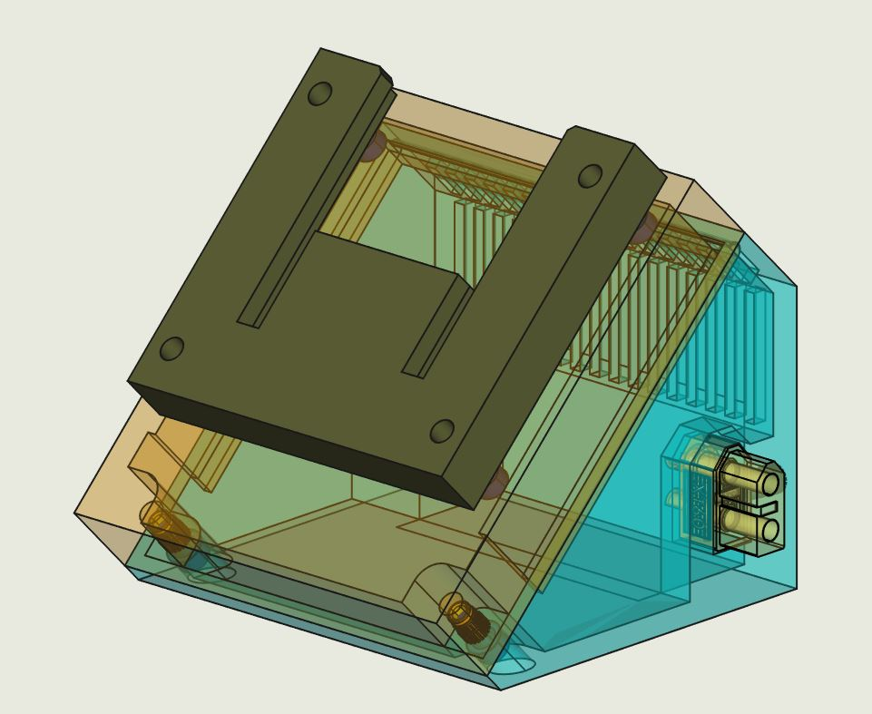

====================================================================================================
Le câblage
====================================================================================================
Rien de très compliqué pour cette partie puisque 2 fils **souple** de forte section suffisent.

Les languettes de connecxion sont réalisées en mailleshort de 0.3mm d'épaisseur plié.

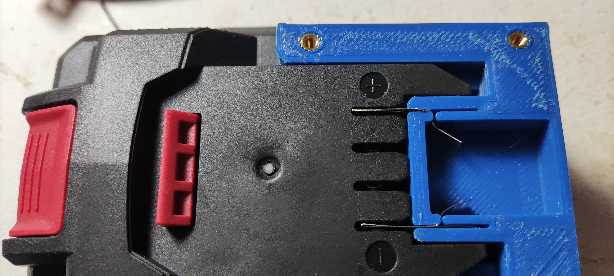

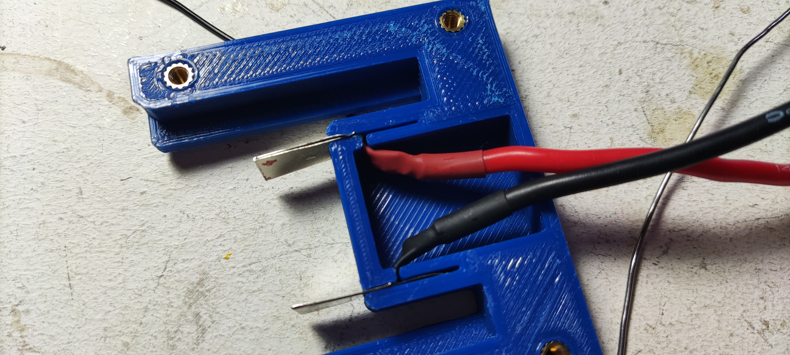

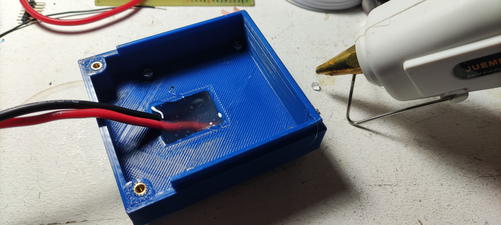

.. |pks_Image9| image:: images/parkside/parksideInside009.jpg
  :width: 200 px

.. list-table::
   :widths: 27 27 27 27
   :header-rows: 1

   * - Essais du pack et de languettes
     - Câblage des languettes
     - Pistocolle pour solidifier le tout
     - Passage des cables

   * - |pks_Image6|
     - |pks_Image7|
     - |pks_Image8|
     - |pks_Image9|

.. NOTE:: le côté gauche du boîtier n'est pas équipé du XT60 femelle.
   :class: without-title

Source mailleshort : `Plaque de maillechort format 280x200x0,40mm chez micromodel`_

56.000mm2 à 24€ soit 0.042cts le mm2 il en faut environ 8*25mm 200m2 8.4cts et biensûr x2 pour le 2 
languettes.

J'ai choisi ce matériaux pour son aspect, sa maléabilité et sa sodabilité.

Source fil de câblage : sur `AMAZON Fil de silicone de calibre 14, 5 mètres`_ pour environ 0.3€

.. _`AMAZON Fil de silicone de calibre 14, 5 mètres` : https://www.amazon.fr/gp/product/B074QR9DT9/ref=ppx_yo_dt_b_asin_title_o05_s01?ie=UTF8&psc=1

.. _`Plaque de maillechort format 280x200x0,40mm chez micromodel` : https://micro-modele.fr/fr/plaques-en-maillechort/5167-plaque-de-maillechort-format-200x100x050mm.html

====================================================================================================
En situation
====================================================================================================
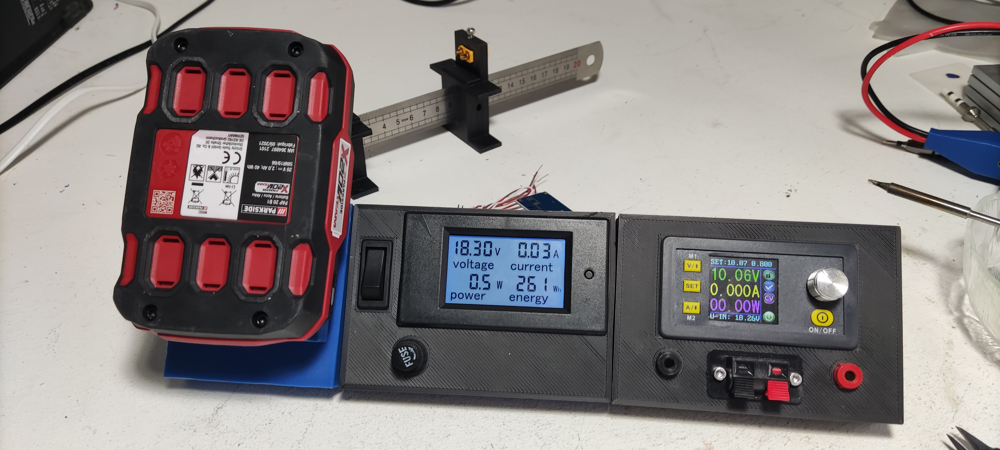

====================================================================================================
Nomenclature
====================================================================================================
.. csv-table:: Nomenclature module Parkside
   :file: ../../_02-realisation/_03-cao_3D/mesCreations/lidlParckSideBat/nomParkside.csv
   :delim: ,
   :encoding: UTF-8
   :align: left

Mise à part la batterie et son chargeur 20 à 25€.

====================================================================================================
Weblinks
====================================================================================================

.. target-notes::