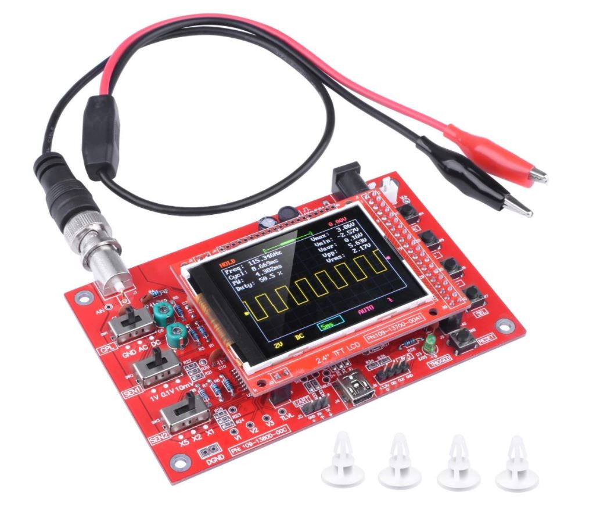
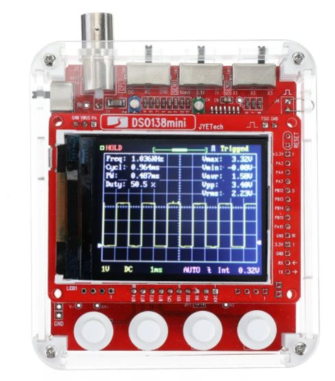
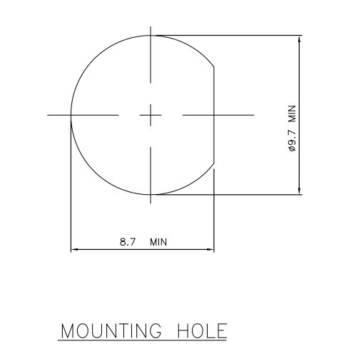
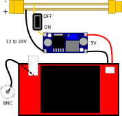
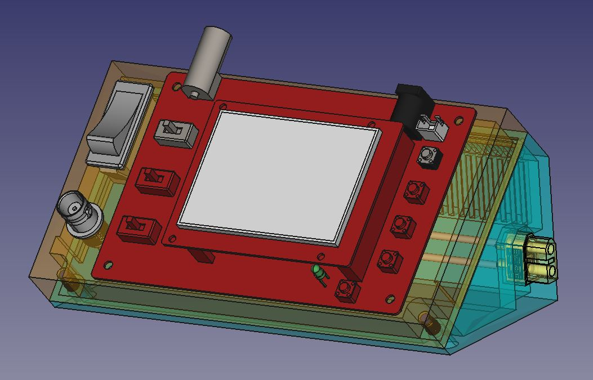
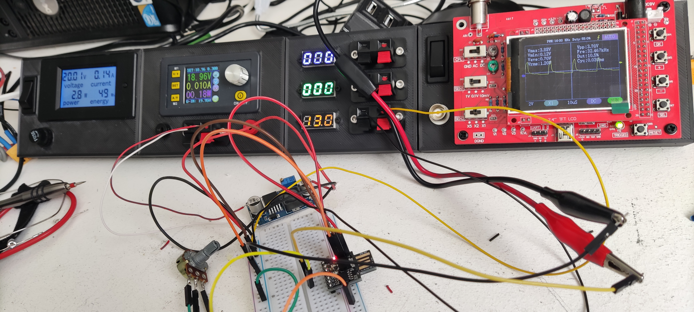

++++++++++++++++++++++++++++++++++++++++++++++++++++++++++++++++++++++++++++++++++++++++++++++++++++
Module oscilloscope DSO138
++++++++++++++++++++++++++++++++++++++++++++++++++++++++++++++++++++++++++++++++++++++++++++++++++++

.. include:: volabid.rst

:Date de création: 10/2022
:Date dernière maj: 10/2022

.. _refOscilloRealisation:

.. index::
    pair: Modules; Oscilloscope

====================================================================================================
Présentation
====================================================================================================
.. WARNING:: REGLER LA TENSION DE SORTIE DU DCDC à 9V sinon ça chauffe
   :class: without-title

   ici 9V

.. _`NOUVEAU JYETech® 13805K DSO138 Mini Oscilloscope Numérique 200KHz` : https://www.banggood.com/fr/NEW-JYETech-13805K-DSO138-Mini-200KHz-Digital-Oscilloscope-SMD-Soldered-Version-DC3_5V-6V-With-Housing-p-1627586.html?utm_source=googleshopping&utm_medium=cpc_organic&gmcCountry=FR&utm_content=minha&utm_campaign=minha-fr-fr-pc&currency=EUR&cur_warehouse=CN&createTmp=1&utm_source=googleshopping&utm_medium=cpc_union&utm_content=sandra&utm_campaign=sandra-ssc-fr-css-all-0423-19bf-v2&ad_id=344815794167&gclid=CjwKCAiAx8KQBhAGEiwAD3EiP3yN54JABv3-oe_jhIRZ2Zv9rc89praeH_G5VnR0Qqd3OnVhP0iA_hoC_KoQAvD_BwE

Sur AMAZON `ARCELI Oscilloscope numérique au Format de Poche, kit Open Source TFT 2,4 Pouces avec sonde, Version assemblée (soudé)`_ à 27€

.. _`ARCELI Oscilloscope numérique au Format de Poche, kit Open Source TFT 2,4 Pouces avec sonde, Version assemblée (soudé)` : https://www.amazon.fr/gp/product/B07V67LYXF/ref=ppx_yo_dt_b_asin_title_o01_s00?ie=UTF8&psc=1

Attention plusieurs versions différentes même sur le site JYE Tech

`NOUVEAU JYETech® 13805K DSO138 Mini Oscilloscope Numérique 200KHz`_ chez BANGGOOD (vue assemblée)

Dimension: 85mm X 75mm X 15mm

La version la plus stable serait la `JYE Tech DSO138mini`_ plus compact et aussi plus cher. 
Pas trouvé assemblée sur AMAZON

.. _`JYE Tech DSO138mini` : https://jyetech.com/dso138mini-oscilloscope-diy-kit/

BNC : code RS :  680-7371, modèle directement récupérer et mis en fichier Freecad.

:download:`Drawing<fichiersJoints/bnc_drawing_0900766b80d9b202.pdf>`

.. WARNING:: REGLER LA TENSION DE SORTIE DU DCDC à 9V sinon ça chauffe
   :class: without-title

   Ici 9V cf. :ref:`Alimentation des modules en plus base tension<refConvertisseurDCDC>`
   

====================================================================================================
Oscillo schéma de câblage
====================================================================================================

====================================================================================================
Rendu FreeCad
====================================================================================================

====================================================================================================
Oscilloscope en situation
====================================================================================================

Test du PWM pour le module Ventilo

====================================================================================================
Nomenclature oscillo DSO138
====================================================================================================
.. csv-table:: Nomenclature oscilloscope DSO138
   :file: ../../_02-realisation/_03-cao_3D/mesCreations/moduleOscillo/nomOscillo.csv
   :delim: ,
   :encoding: UTF-8
   :align: left
   :header-rows: 1

====================================================================================================
Weblinks
====================================================================================================

.. target-notes::