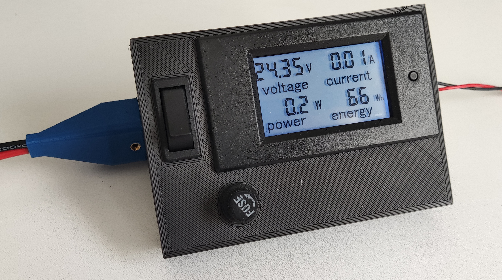
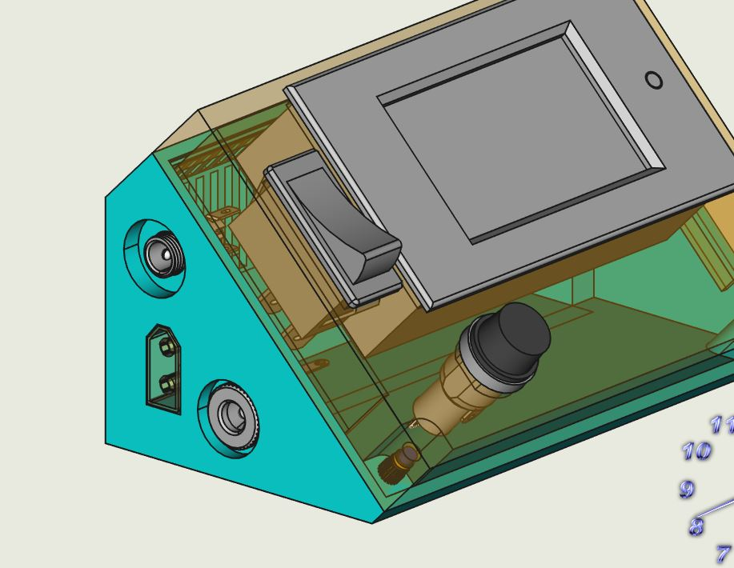
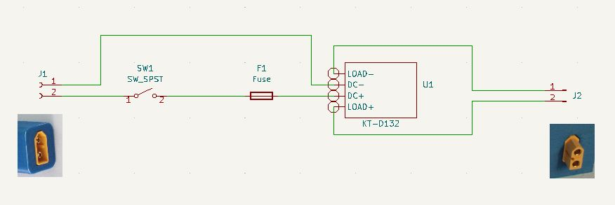

++++++++++++++++++++++++++++++++++++++++++++++++++++++++++++++++++++++++++++++++++++++++++++++++++++
Module primaire mesure Tension/courant de la ligne
++++++++++++++++++++++++++++++++++++++++++++++++++++++++++++++++++++++++++++++++++++++++++++++++++++

.. include:: volabid.rst

:Date de création: 10/2022
:Date dernière maj: 07/10/2022

.. index::
    pair: Modules; U/I en ligne

====================================================================================================
Présentation
====================================================================================================

.. image:: images/uimodule.JPG 
   :width: 600 px

.. image:: images/uiWatmetreAmazon.jpg 
   :width: 300 px

Le but de ce module est d'indiquer la tension et le courant consommé par les modules qui se trouvent
après lui dans la chaîne. 

C'est le seul module qui n'est pas en parallèle sur les 2 tiges d'alimentation.

    Ajout de connecteurs DC5525 et DC5521 

====================================================================================================
Schéma électrique
====================================================================================================

====================================================================================================
Nomenclature
====================================================================================================

.. csv-table:: Nomenclature module primaire U/I
   :file: ../../_02-realisation/_03-cao_3D/mesCreations/moduleUI/nomUILigne.csv
   :delim: ,
   :encoding: UTF-8
   :align: left
   :header-rows: 1

Module KT-D132 `KETOTEK Voltmetre Amperemetre 12V DC 6.5-100V 20A`_

.. _`KETOTEK Voltmetre Amperemetre 12V DC 6.5-100V 20A` : https://www.amazon.fr/gp/product/B07M8T3T2C/ref=ppx_yo_dt_b_asin_title_o08_s01?ie=UTF8&psc=1

====================================================================================================
Weblinks
====================================================================================================

.. target-notes::