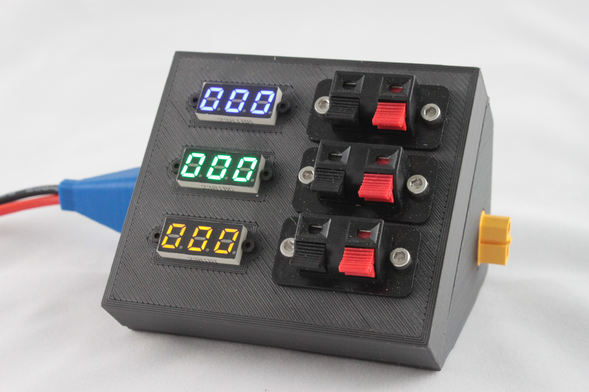
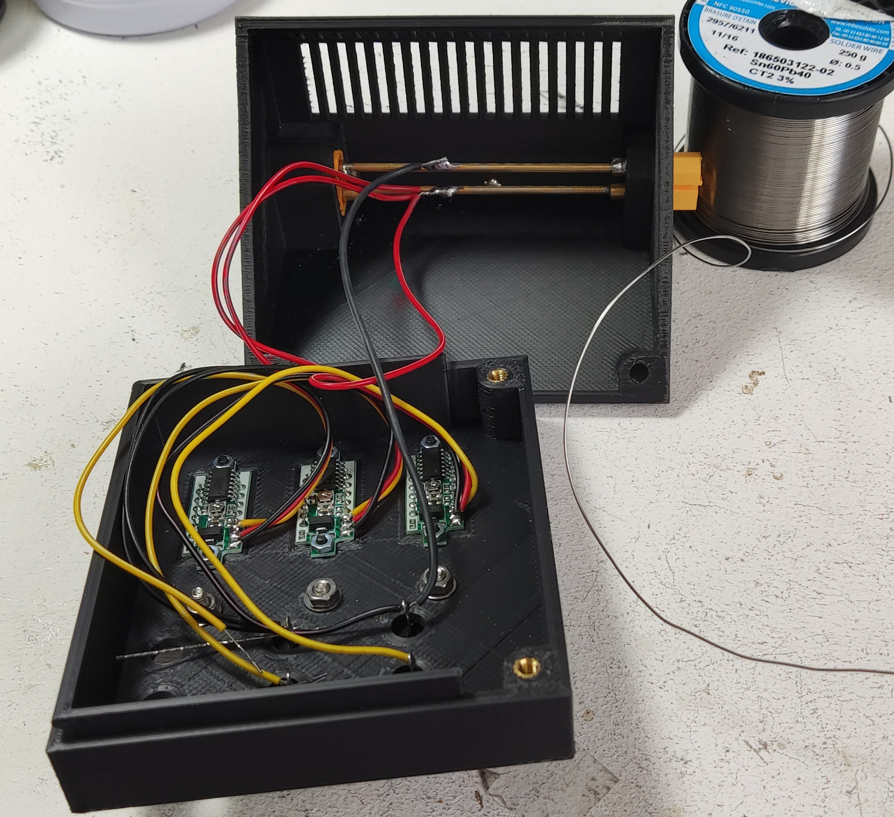

++++++++++++++++++++++++++++++++++++++++++++++++++++++++++++++++++++++++++++++++++++++++++++++++++++
Module triple tiny voltmètres
++++++++++++++++++++++++++++++++++++++++++++++++++++++++++++++++++++++++++++++++++++++++++++++++++++

:Auteur: J.Soranzo
:Date de création: 11/2022
:Date dernière maj: 08/11/2022
:Societe: VoRoBoTics
:Entity: VoLAB

====================================================================================================
Présentation
====================================================================================================
L'objectif ici est de mettre le plus possible de voltmètre dans un seul module de taille raisonnable.

J'ai opté pour de petit voltmètre tout intégrés avec alimentation séparée en 3 fils. Cela permet
d'alimenter les module même en l'absence de tension à mesurer. Mais nécessite l'utilisation d'un 
convertisseur DC/DC cf :ref:`ci-dessus<moduleDCDC2596>`. Non en fait ils peuvent être directement 
alimenté en 24v

Pour la connectique, les prise audio feront l'affaire elle permettent des branchements rapides.

.. WARNING:: ATTENTION GND commun à tout ce petit monde
   :class: without-title

2.4 to 30V 0.28" chez Banggood Aliexpress ou 

`GTIWUNG 4Pcs Mini Voltmètre, Numérique DC Voltmètre 0.28 Pouce, Panneau 0-100V DC 3 Fils`_

.. _`GTIWUNG 4Pcs Mini Voltmètre, Numérique DC Voltmètre 0.28 Pouce, Panneau 0-100V DC 3 Fils` : https://www.amazon.fr/gp/product/B07VCN8YQ4/ref=ppx_yo_dt_b_asin_title_o02_s00?ie=UTF8&psc=1

.. image:: images/028voltmeter.jpg 
   :width: 300 px

====================================================================================================
Rendu FreeCAD
====================================================================================================
.. image:: images/tripleVolmetre.jpg 
   :width: 600 px

====================================================================================================
Photo
====================================================================================================

====================================================================================================
Câblage
====================================================================================================
En guise de cablag, je ne mettrai ici qu'une photo vu la simplicité !

====================================================================================================
Nomenclature
====================================================================================================

.. csv-table:: Nomenclature triple tiny voltmètres
   :file: ../../_02-realisation/_03-cao_3D/mesCreations/moduleVoltmètres/nomTripleTinyVoltmetre.csv
   :delim: ,
   :encoding: UTF-8
   :align: left
   :header-rows: 1

====================================================================================================
Weblinks
====================================================================================================

.. target-notes::