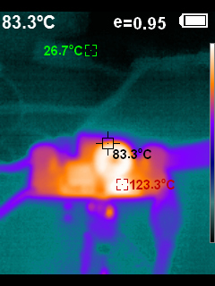
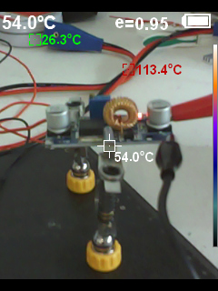
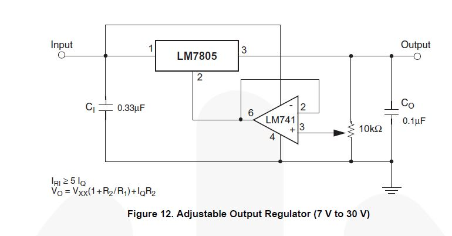
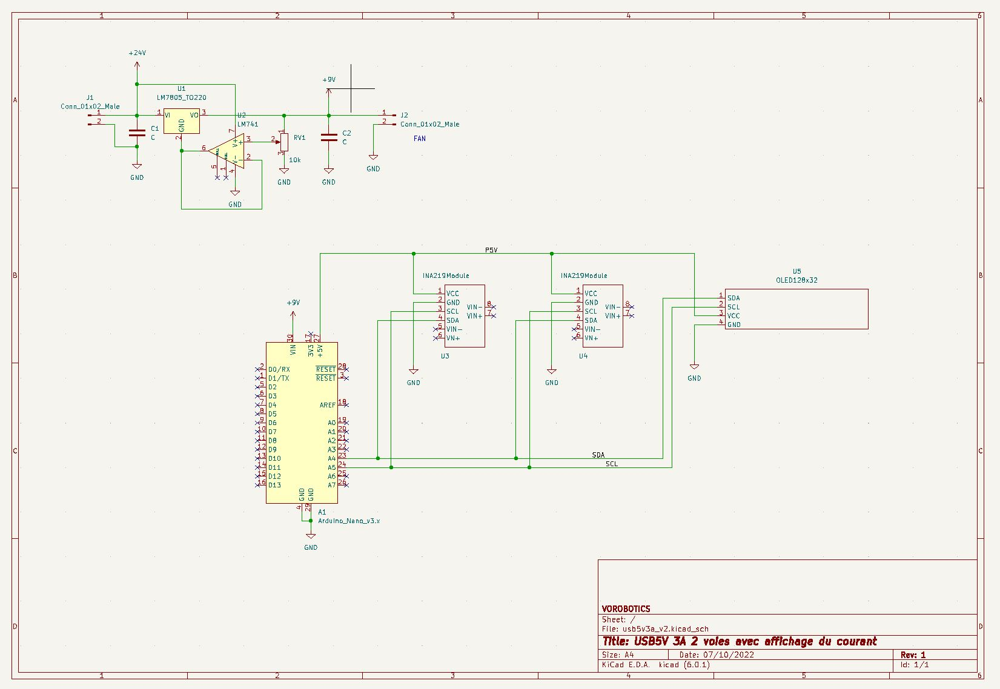
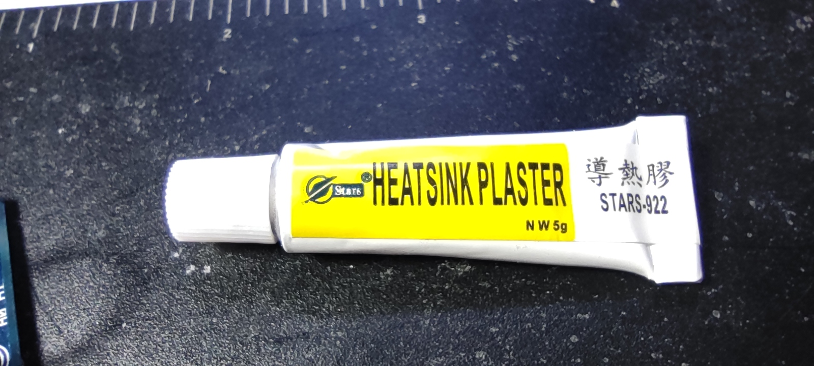
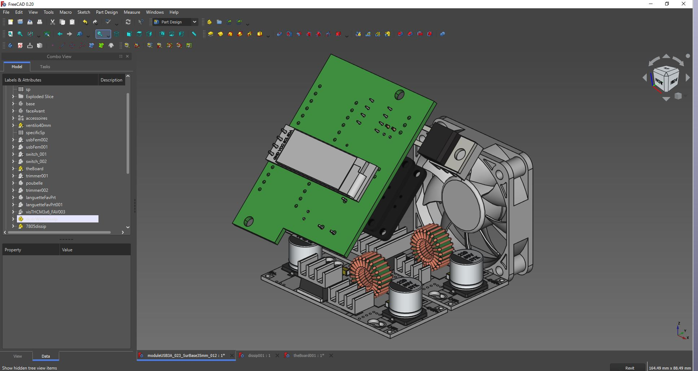
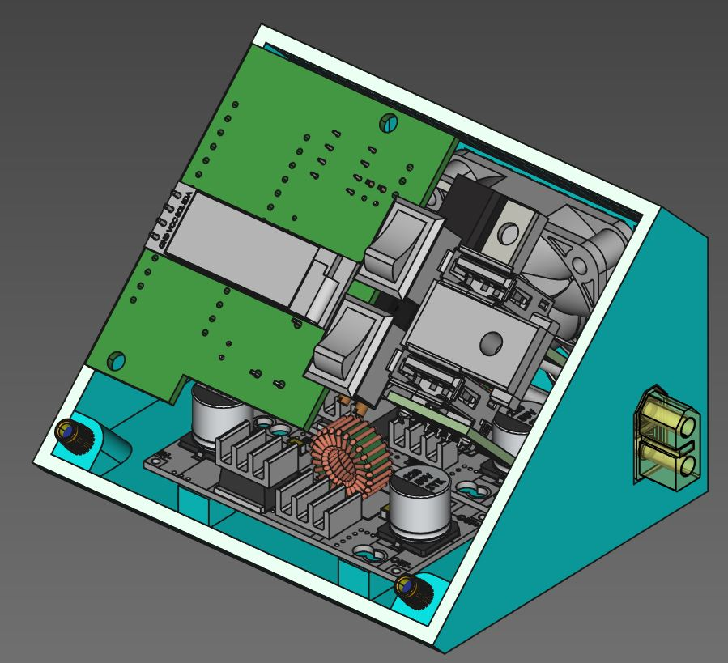
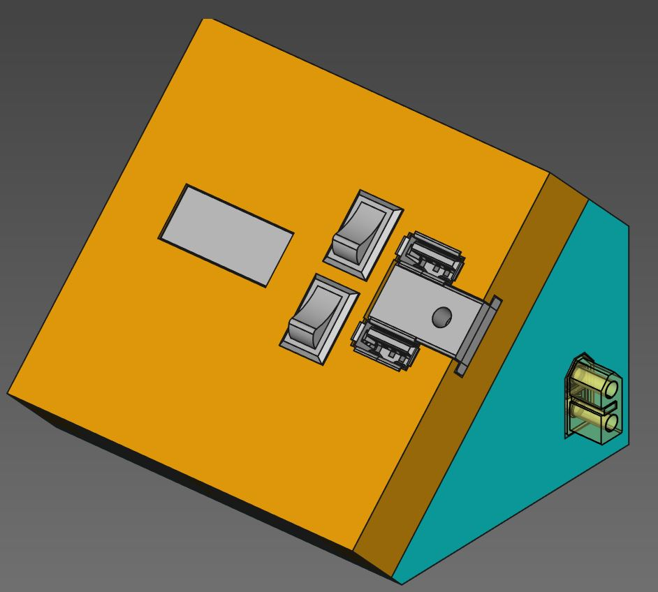

++++++++++++++++++++++++++++++++++++++++++++++++++++++++++++++++++++++++++++++++++++++++++++++++++++
Module USB 2x 5A avec ampèremètre
++++++++++++++++++++++++++++++++++++++++++++++++++++++++++++++++++++++++++++++++++++++++++++++++++++

:Auteur: J.Soranzo
:Date de création: 10/2022
:Date dernière maj: 10/2022
:Societe: VoRoBoTics
:Entity: VoLAB

====================================================================================================
Présentation/objectif
====================================================================================================
On souhaite ici un module avec 2 prise USB capable de délivrer chacune 3A pour éventuellement 
alimenter 2 Raspberry pi avec un écran qui affiche tension courant pour chaque voie.

====================================================================================================
Module XL4015 évaluation à 3A
====================================================================================================

La base est le convertisseur DCDC XL4015

`TECNOIOT 5pcs 5A XL4015 DC-DC Step Down Adjustable Power Supply Module LED Lithium Charger`_
    
.. _`TECNOIOT 5pcs 5A XL4015 DC-DC Step Down Adjustable Power Supply Module LED Lithium Charger` : https://www.amazon.fr/gp/product/B07XXFZFQJ/ref=ppx_yo_dt_b_asin_title_o04_s00?ie=UTF8&psc=1

En testant ce module en charge (avec une charge active) à 5V 3A, on s’aperçoit que ce n'est pas 
régulateur qui chauffe mais la diode et la self comme le montre les images infra-rouge.

.. list-table::
   :widths: 27 27 
   :header-rows: 1

   * - Image IR
     - Image réelle

   * - |aliasXL4015IR_1|
     - |aliasXL4015IR_2|

Ces images ont été réalisées avec la `caméra infra-rouge Hti-Xintai HT18`_ sur l'image réelle la 
parallaxe des 2 objectifs fait que les température ne sont  pas aux bons endroits. C'est l'image IR
qui compte

.. _`caméra infra-rouge Hti-Xintai HT18` : https://www.amazon.fr/gp/product/B07BDJZ845/ref=ppx_yo_dt_b_asin_title_o06_s00?ie=UTF8&psc=1

Lorsque le module délivre 5V / 3A la température de la diode se situe aux environs de 120°C. C'est 
beaucoup

====================================================================================================
Design du module
====================================================================================================
Compte tenu de l'essai ci-dessus je décide d'incorporer un ventilateur de 40mm au module.

Je décide également de mettre 2 voies 5V/3A donc d'utiliser 2 convertisseurs.

De plus étant donné que cela doit pouvoir servir à alimenter un raspberry pi, il serait bien de 
disposer d'une lecture du courant. Je n'est rien trouvé de suffisamment petit.

J'envisage de réaliser le double ampèremètre grâce à:

- 2 modules INA219
- 1 ARDUINO NANO
- 1 écran OLED I2C monocrome de 0.91" 128 x 32

Toutefois à 3A la chute de tension provoqué par le module INA219 et son shunt de 0.1 ohm risque 
d'être non négligeable : 0.3V. Il est possible de compenser cela en dessoudant le potar de feedback 
et en le plaçant après le shunt.

.. WARNING::

   Nouveau pb : 
   
   alimentation ventilo: en 24V, il fait énormément de bruit, je ne suis pas certain que 
   ce soit un ventilo 24V. 
   
   Il tourne bien en 5V mais le débit d'air semble un peu faible. 8, 9V
   semble un bon compromis. Sauf que je n'ai pas d'alim à cette valeur dans le module.

Conso ventilo : 24mA en 12V ventilo 1 (avec étiquette 24V), 49mA en 12V ventilo 2 origine ?

Solutions:

- un autre DC/DC XL4015 : pas la place et un peu riche pour un ventilo
- du PWM depuis l'ARDUINO : maîtrise de la vitesse et possibilité de régul en fonction de T°c
      - Echec: le ventilateur siffle (même à 32kHz en PWM) et la plage de réglage et très courte
- Mettre un simple régulateur : Lm1084 ou 7805

Transistor pour le PWM ou celui utilisé dans le module ventilo:
630
20
N3LG  ON SEMI

7805 pour alimenter l'arduino.

Conso : environ 50mA (mesuré à 25) soit à dissiper 24-5 = 19V P=UxI = 19x0.05 = 0.95W

En parcourant la datasheet du 7805, je suis tombé sur cette figure:

Il est donc possible à partir du 7805 de faire du 9V qui pourrait servir à alimenter le ventilo ET 
l'ARDUINO sur son  Vin.

I2C scan : 0x3C, 0x40 et 0x41

====================================================================================================
Schémas électroniques
====================================================================================================
De la carte (sans les LM35)
----------------------------------------------------------------------------------------------------

Les LM35 ont été ajoutés après coup en fil volant.

====================================================================================================
Mesure de température (LM35)
====================================================================================================
Ajout de dernière minute.

Comment : l'arduino à des entrée analogique dispo.

Qu'est ce que j'ai ?

- LM35 :download:`datasheet<fichiersJoints/lm35dts.pdf>`

J'ai câblé 2 de ces capteur sur les entrées analogique A0 et A1

.. |LM35_cablage01| image:: images/USB2X3A_LM35Cablage01.png
   :width: 200 px

.. |LM35_cablage02| image:: images/USB2X3A_LM35Cablage02.png
  :width: 200 px

.. list-table::
   :widths: 27 27 
   :header-rows: 1

   * - Câblage LM35 sous l'ARDUINO
     - Câblage LM35 collés au dissipateurs

   * - |LM35_cablage01|
     - |LM35_cablage02|

Les 2 capteurs sont collés aux dissipateurs grâce à de la colle thermique 
(pas de la pate mais bien de la colle ! ).

====================================================================================================
Rendus FreeCad
====================================================================================================
L'intérieur du module très chargé et encore, il n'y a pas les fils de cablage...

La même avec en plus la base, les switch et les prise USB:

Et avec

====================================================================================================
Nomenclature
====================================================================================================
Pour la nom : tige de laiton longueur : 68.62mm

====================================================================================================
Weblinks
====================================================================================================

.. target-notes::